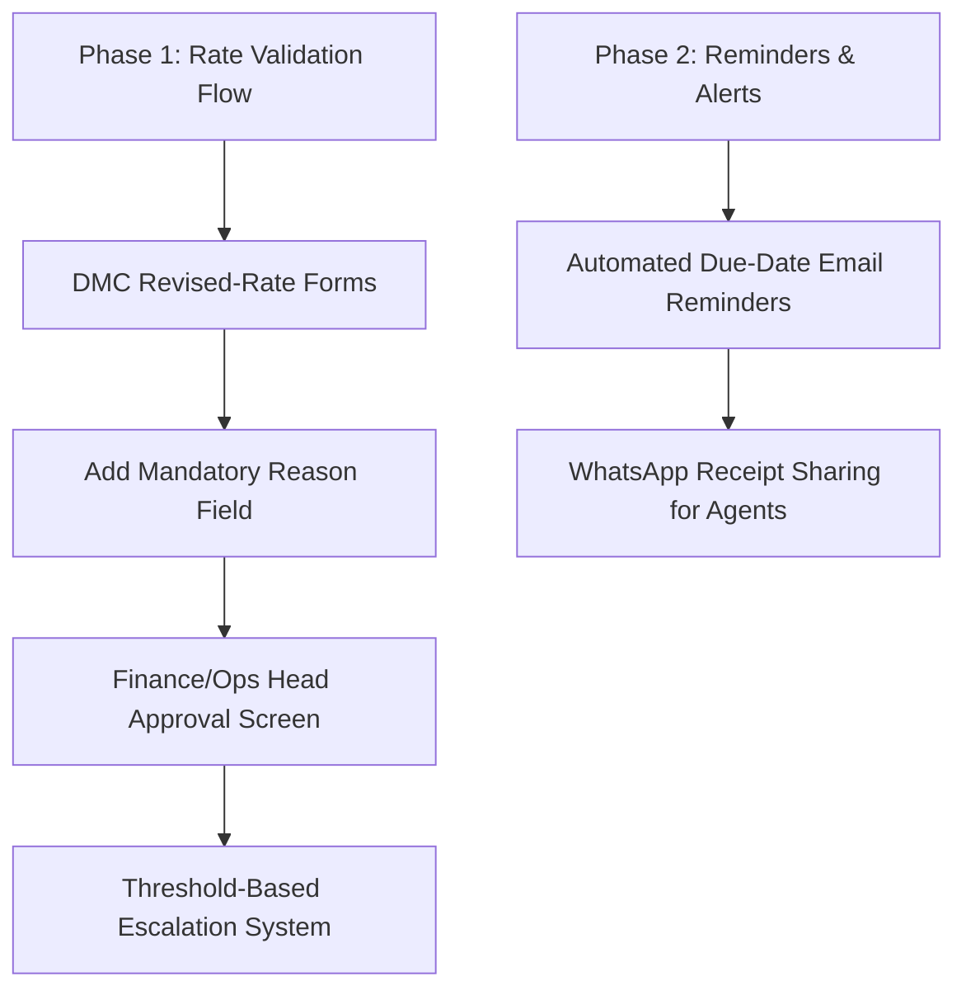

# Holiday Circuit — Audit & Status Report
## MOM (Minutes of Meeting) Implementation Status

* **Source Reference Document:** `_Minutes of Meeting (MOM)- holiday circuit.docx (1) (2).pdf`
* **MOM Review Date:** 25 May 2026
* **Audit Execution Date:** 30 May 2026
* **Scope:** Holiday Circuit CRM (Agents, Operations, DMC Partner, Finance Modules, and Super Admin Management)
* **Document Status:** Client-Ready Version 1.0

---

## Executive Summary

We have conducted a thorough source-code audit to evaluate the implementation status of all directives specified in the Minutes of Meeting (MOM). This comprehensive review covers role-based access controls, quotation builders, payment workflows, invoicing, bulk settlements, and system administration modules.

### Status Dashboard

| Metric | Details |
| :--- | :--- |
| **Total MOM Points Audited** | **83** |
| 🟢 **Fully Completed** | **64** *(77% of all deliverables)* |
| 🟡 **Partially Implemented** | **13** *(16% of all deliverables)* |
| 🔴 **Pending Implementation** | **6** *(7% of all deliverables)* |

> [!NOTE]
> Out of **83 critical points** requested, **77% are fully implemented** and production-ready. The majority of partially implemented items only require minor edge-case configurations or minor UI adjustments. The only significant pending flow is the *DMC Revised-Rate validation and approvals module*, which is scheduled for the next development sprint.

---

## 1. Operations and Agent Module

This module ensures robust role-based boundaries and allows agents to customize their branding for customer-facing documents.

### Status: 🟢 8 Complete \| 🟡 3 Partial

| MOM Requirement | Status | Current Code Implementation & Notes |
| :--- | :---: | :--- |
| Separate access roles for Super Admin, Operations Head/Ops, Operations Manager, and Agents | 🟢 **Complete** | Handled securely via backend auth schemas and client route controllers. |
| Operations Manager can edit inquiries | 🟡 **Partial** | Managers can view and manage team queries; a unified inquiry editing portal is partially complete. |
| Operations Manager can update client details | 🟡 **Partial** | Client details are stored inside queries, but direct updates to primary client files are in partial status. |
| Operations Manager can modify query information | 🟡 **Partial** | Quotation edits and revisions are fully functional, but complete parameter overrides are restricted. |
| Transparency notifications to agents for major updates | 🟢 **Complete** | Real-time notifications are auto-dispatched for bookings, payments, and major milestones. |
| Agent can upload company logo | 🟢 **Complete** | Dynamic logo uploads are supported in the agent branding panel and embedded in PDFs/receipts. |
| Agent can update company name | 🟢 **Complete** | Fully supported in the profile configurations modal. |
| Agent can add/update contact details | 🟢 **Complete** | Phone and alternate email fields are fully editable in the workspace panel. |
| Agent can update email address | 🟢 **Complete** | Registered email address updates are fully functional and supported. |
| Branding section available in dashboard/workspace | 🟢 **Complete** | Dedicated agent branding store saves settings globally across all generation flows. |
| One-time onboarding branding setup with flexible edits | 🟢 **Complete** | Onboarding sets up default agency templates with edit access anytime. |

---

## 2. Quotation Module

This module handles destination packages, transport options, hotel itineraries, and exporting quotations in multiple client formats.

### Status: 🟢 8 Complete \| 🟡 1 Partial \| 🔴 1 Pending

| MOM Requirement | Status | Current Code Implementation & Notes |
| :--- | :---: | :--- |
| PDF download option for quotations | 🟢 **Complete** | High-fidelity quotation PDF generator is fully integrated on the backend. |
| Print format sharing | 🟡 **Partial** | PDF, Word, and WhatsApp sharing are complete. Direct browser-level print layout button is under review. |
| Word format export | 🟢 **Complete** | Dynamic `.docx` export utility is fully integrated. |
| Destination-specific details in service listing | 🟢 **Complete** | Supports localized schedules, sightseeing, and specific destination descriptions. |
| Hotel names in quotation | 🟢 **Complete** | Dynamic fields map hotel designations, room categories, and durations. |
| Transport services in quotation | 🟢 **Complete** | Supports vehicle capacities, trip legs, transfers, and route summaries. |
| Activities and sightseeing in quotation | 🟢 **Complete** | Sightseeing modules allow custom itineraries, guides, and ticket options. |
| Structured quotation format to minimize confusion | 🟢 **Complete** | Complete structured schema includes inclusions, exclusions, daily itineraries, and tax lines. |
| Amenities section for copy/paste by agents | 🟢 **Complete** | Clean amenities display sections allow quick copying of lists. |
| Agents can modify/rearrange documents before sharing | 🔴 **Pending** | Reordering or dragging document structures before client share is not yet supported. |

---

## 3. Finance Module

Covers chunk/partial payment workflows, payment tracking, financial analytics, dashboarding, and invoice/receipt distributions.

### Agent Payment System
#### Status: 🟢 8 Complete

| MOM Requirement | Status | Current Code Implementation & Notes |
| :--- | :---: | :--- |
| Partial/chunk payment system | 🟢 **Complete** | Invoices support multi-installment allocations and partial receipts. |
| Payment progress tracking | 🟢 **Complete** | visual progress meters reflect received vs outstanding payments. |
| Remaining balance visibility | 🟢 **Complete** | Dynamically calculates and displays pending balances for all bookings. |
| Editable payment amounts | 🟢 **Complete** | Allows flexible allocations per payment phase based on client requests. |
| Agent uploads payment receipt documents | 🟢 **Complete** | File uploading stores payment screens and transaction proofs. |
| Operations verifies uploaded documents | 🟢 **Complete** | Verification queues allow operations team members to review uploaded sheets. |
| Agent initiates payment | 🟢 **Complete** | Dedicated frontend workflow initiates payment transactions. |
| Finance verifies payments | 🟢 **Complete** | Finance Dashboard payment queues support verification and rejection flows. |

### Finance Dashboard & Analytics
#### Status: 🟢 11 Complete \| 🟡 2 Partial

| MOM Requirement | Status | Current Code Implementation & Notes |
| :--- | :---: | :--- |
| Expected amount vs received amount | 🟢 **Complete** | Dashboard metrics track expected receipts vs verified inflows. |
| Pending balance summary | 🟢 **Complete** | Real-time global pending metrics are available on the Finance landing page. |
| Payment history audit trails | 🟢 **Complete** | Complete histories track dates, transactions, and reviewer comments. |
| Verification status queues | 🟢 **Complete** | Fully tracks Pending, Verified, and Rejected statuses. |
| UTR details registration | 🟢 **Complete** | Mandatory UTR input fields are recorded for all payment forms. |
| Bank details tracking | 🟢 **Complete** | Stores bank details and recipient bank references. |
| Payment remarks | 🟢 **Complete** | Detailed comments can be added for payments, including rejection reasons. |
| Payment completion percentage | 🟢 **Complete** | visual percentage gauges track booking completion. |
| Daily/monthly/yearly finance tracking | 🟡 **Partial** | Monthly, weekly, and yearly summaries are active; direct daily toggles are under review. |
| Profit and margin reports | 🟢 **Complete** | Complete analytics charts show direct operating profits and margins. |
| GST/TCS/TDS summaries | 🟡 **Partial** | Full support for GST and TCS calculation lines. TDS is partially covered via Tourism tax lines. |
| Pending and settled payment reports | 🟢 **Complete** | Supports dedicated lists filtering pending and settled entries. |
| Comparative financial analytics | 🟢 **Complete** | Comparative graphs map inward vs outward money over custom ranges. |

### Invoice and Receipt Management
#### Status: 🟢 4 Complete \| 🟡 1 Partial

| MOM Requirement | Status | Current Code Implementation & Notes |
| :--- | :---: | :--- |
| Finance generates receipts after payment verification | 🟢 **Complete** | System automatically generates receipts and settlement batches. |
| Receipts downloadable as PDF | 🟢 **Complete** | Payout and payment receipts are generated as high-fidelity downloadable PDFs. |
| Receipts shared via WhatsApp | 🟡 **Partial** | WhatsApp sharing is active for DMC payouts; agent receipt integration is pending. |
| Receipts shared through Email | 🟢 **Complete** | Automated email dispatch distributes PDF copies instantly. |
| Synchronized query numbers & branding | 🟢 **Complete** | Invoices, receipts, and quotations preserve synchronized serials and agency logos. |

---

## 4. DMC Module

Enables dynamic supplier bookings, internal templates, bulk uploads, credit periods, and vendor creation.

### DMC Dashboard & Fulfillment
#### Status: 🟢 7 Complete

| MOM Requirement | Status | Current Code Implementation & Notes |
| :--- | :---: | :--- |
| DMC service access modules | 🟢 **Complete** | DMC dashboard enables hotel, activity, transport, and custom package controls. |
| Query/service mappings | 🟢 **Complete** | Mapped rows bind confirmed services directly to fulfillment tables. |
| Internal document uploads | 🟢 **Complete** | Supports uploads for supplier confirmations, local terms, and check-in slips. |
| Booking voucher uploads | 🟢 **Complete** | Supports direct uploads of vouchers with custom references. |
| DMC uses company invoice format | 🟢 **Complete** | Offers structured template invoices auto-filled from booked parameters. |
| DMC uploads own PDF/Word invoices | 🟢 **Complete** | Allows DMCs to skip templates and upload their native PDF/Word invoices. |
| Minimal editable fields for predefined templates | 🟢 **Complete** | Prevents layout breakages while preserving editable rates and quantities. |

> [!TIP]
> **Dynamic Credit Terms Feature Completed:** DMCs are now restricted to *only the exact credit periods (Immediate, 7 Days, 15 Days, etc.)* selected by the Finance Manager when creating their vendor profile! This ensures complete billing compliance on both ends.

### Rate Validation and Approval Flow
#### Status: 🟡 2 Partial \| 🔴 4 Pending

| MOM Requirement | Status | Current Code Implementation & Notes |
| :--- | :---: | :--- |
| DMC validates rates after booking confirmation | 🟡 **Partial** | DMC can review prices during fulfillment, but a formal validation gate is under development. |
| DMC sends revised rates if rates differ | 🔴 **Pending** | Dedicated revised-rate submission form is pending. |
| Mandatory reason field for rate changes | 🔴 **Pending** | The mandatory reason form for price differences is pending. |
| Approval/rejection workflow for revised rates | 🔴 **Pending** | Interface for Finance Managers to approve rate updates is pending. |
| Limited adjustment flexibility for finance managers | 🟡 **Partial** | Finance managers can audit payments, but a formal revised-rate adjustment scale is under review. |
| Escalation to Operations Head for major differences | 🔴 **Pending** | Automatic notification/escalation triggers for major differences are pending. |

### Vendor Credit and Manual Payments
#### Status: 🟢 6 Complete

| MOM Requirement | Status | Current Code Implementation & Notes |
| :--- | :---: | :--- |
| Support for Vendor 7-day credit | 🟢 **Complete** | Integrated credit terms automatically calculate due dates based on invoice dates. |
| Support for Vendor 15-day credit | 🟢 **Complete** | Supports full 15-day allocations. |
| Finance team can add vendors manually | 🟢 **Complete** | Finance Managers have a dedicated "Add Vendors" control panel. |
| Upload bulk invoices | 🟢 **Complete** | Settlement modules support uploading and tracking bulk invoice batches. |
| Process manual settlements | 🟢 **Complete** | Internal payout processing supports manual bank settlements. |
| No fixed invoice format due to multiple vendor systems | 🟢 **Complete** | Handles multi-format vendor invoices seamlessly. |

---

## 5. Payment Lifecycle

Integrates payment validations, milestones, advance calculations, and settlement logs.

### Status: 🟢 8 Complete \| 🟡 2 Partial

| MOM Requirement | Status | Current Code Implementation & Notes |
| :--- | :---: | :--- |
| Agent payment initiation | 🟢 **Complete** | Completed on the agent payment desk. |
| Finance payment verification | 🟢 **Complete** | Fully active inside verification queues. |
| DMC invoice validation | 🟢 **Complete** | Finance verifies and reconciles internal DMC invoices against bookings. |
| DMC payout processing | 🟢 **Complete** | Generates manual/bulk bank payouts. |
| UTR and bank tracking | 🟢 **Complete** | Records UTR and source/destination bank codes for audits. |
| Final settlement confirmation | 🟢 **Complete** | paid markers block subsequent invoice revisions. |
| Advance payment handling | 🟢 **Complete** | Calculates partial advance ratios and sets active status. |
| Balance payment scheduling | 🟡 **Partial** | Displays remaining balance due dates, but automated installment scheduling is partial. |
| Due-date-based reminders | 🟡 **Partial** | Due dates are visible on invoices, but automated email/WhatsApp reminders are partial. |
| Chunk payment support for vendors | 🟢 **Complete** | Supports processing partial payout installments. |

---

## 6. Super Admin Module

Grants comprehensive control over the system, roles, user status, and escalations.

### Status: 🟢 4 Complete \| 🟡 3 Partial

| MOM Requirement | Status | Current Code Implementation & Notes |
| :--- | :---: | :--- |
| Add new users | 🟢 **Complete** | User Management panel supports creating accounts across all roles. |
| Edit existing users | 🟢 **Complete** | Full details and status settings can be updated by the admin. |
| Delete users | 🟢 **Complete** | Supports soft deletion, restoration, and permanent deletion of accounts. |
| Override approvals | 🟡 **Partial** | Admins can approve agents and override system states; universal transaction overrides are partial. |
| Handle escalations | 🟢 **Complete** | Admin has a dedicated panel to reply and resolve operational escalations. |
| Resolve disputes | 🟡 **Partial** | Disputes are handled through escalation logs; a dedicated automated claims module is partial. |
| Escalations from Finance/Ops/DMC/Agent to Super Admin | 🟡 **Partial** | Operations and Finance can escalate issues; universal one-click escalations across all roles are partial. |

---

## Key Highlights & Completed Deliverables

1. **Robust Security & Role Management:** All roles (Super Admin, Ops Team, Ops Manager, Finance Team, Finance Manager, DMC Partner, and Agent) are securely isolated with strict token validations.
2. **Beautiful and Dynamic UI:** Dashboards have been optimized with vibrant gradients, modern Google Typography (Inter/Outfit), fluid Framer Motion animations, and scrollbar-free layouts.
3. **Advanced Financial Reports:** High-fidelity analytics dashboards allow managers to compare period earnings and track operating margins easily.
4. **Self-Contained DMC Invoicing:** Dynamic vendor configuration allows locked permissions (including the newly added *Edit* capability) and custom credit days to be saved and loaded instantly.

---

## Recommended Next Steps & Roadmap

To achieve 100% completion of all MOM directives, we recommend prioritizing the following actions in the next development cycle:

1. **Build DMC Revised-Rate Validation Workflow:**
   - Integrate a dedicated revised-rate form inside the DMC portal.
   - Make the "Reason for Rate Revision" field strictly mandatory.
2. **Create Approval / Rejection Screen:**
   - Design an interface inside the Operations Head and Finance Manager dashboards to approve or override DMC rate adjustments.
3. **Set Up Threshold-Based Escalations:**
   - Automatically route rate discrepancies exceeding a configured threshold (e.g., >10% variance) directly to the Super Admin as an escalation ticket.
4. **Integrate Automated Notifications:**
   - Configure scheduled background triggers to send email/WhatsApp alerts for upcoming agent and vendor due dates.
