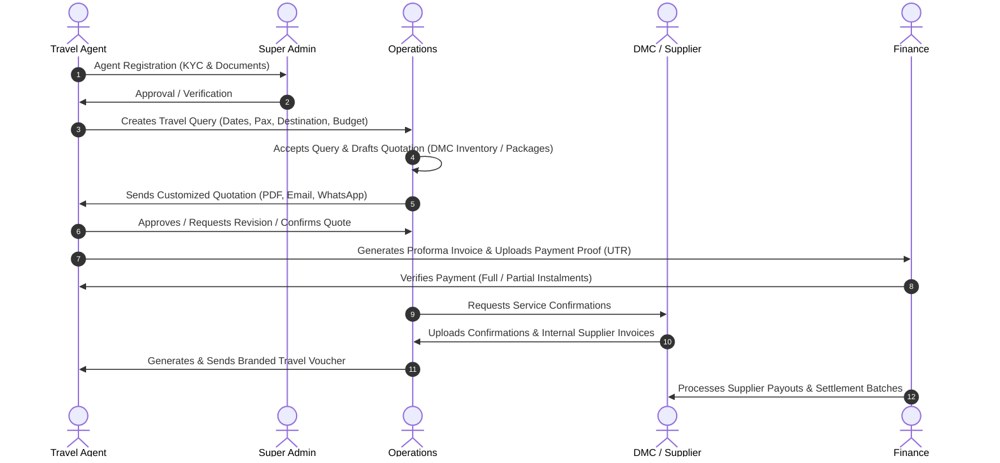

# Holiday Circuit 🌍✈️
> **Next-Generation B2B Travel Operations & ERP Platform**

[](#technology-stack)
[](#frontend)
[](#backend)
[](#database)
[](#multi-portal-ecosystem)

---

## 📌 Table of Contents
- [Executive Overview](#-executive-overview)
- [End-to-End Business Lifecycle](#-end-to-end-business-lifecycle)
- [Multi-Portal Ecosystem & Roles](#-multi-portal-ecosystem--roles)
- [Key Features & Modules](#-key-features--modules)
  - [1. Travel Query & CRM Engine](#1-travel-query--crm-engine)
  - [2. Quotation Builder & Customizer](#2-quotation-builder--customizer)
  - [3. Proforma Invoicing & Dynamic Seller Billing](#3-proforma-invoicing--dynamic-seller-billing)
  - [4. DMC Contracted Rates & Bulk Excel Upload](#4-dmc-contracted-rates--bulk-excel-upload)
  - [5. Payment Verification & Finance Settlements](#5-payment-verification--finance-settlements)
  - [6. Travel Voucher Generation Engine](#6-travel-voucher-generation-engine)
  - [7. OCR & Smart Document Extraction](#7-ocr--smart-document-extraction)
- [Technology Stack](#-technology-stack)
- [Project Architecture & Directory Structure](#-project-architecture--directory-structure)
- [Environment Configuration](#-environment-configuration)
- [Installation & Getting Started](#-installation--getting-started)
- [API Routes Reference](#-api-routes-reference)
- [Development & Build Scripts](#-development--build-scripts)

---

## 🏢 Executive Overview

**Holiday Circuit** is a comprehensive, enterprise-grade B2B travel management and operations ERP platform. It seamlessly connects Travel Agents, Operations Teams, Destination Management Companies (DMC / Suppliers), and Finance Teams into a unified, transparent, and auditable digital workflow.

From an agent's initial trip enquiry to customized quotation drafting, automated proforma invoicing, payment verification, supplier booking fulfillment, and final travel voucher dispatch, Holiday Circuit streamlines every step of the travel booking lifecycle.

---

## 🔄 End-to-End Business Lifecycle



---

## 👥 Multi-Portal Ecosystem & Roles

Holiday Circuit features 7 dedicated workspaces tailored for specific operational roles:

| Workspace / Portal | Role | Primary Responsibilities |
| :--- | :--- | :--- |
| **Agent Portal** | `agent` | Create queries, manage client leads & documents, customize quotations, generate proforma invoices, submit payment proofs (UTR/receipts), download travel vouchers. |
| **Admin Portal** | `admin`, `super_admin` | KYC agent approvals, user & staff management, coupon campaigns, contracted rate approvals, dispute escalations, finance analytics & global audit logs. |
| **Operations Portal** | `operations` | Order acceptance queue, traveler KYC document verification, quotation drafting with DMC inventory, itinerary building, travel voucher generation. |
| **Operations Manager** | `operation_manager` | Team workload monitoring, query reassignment, performance tracking, operational escalations. |
| **DMC Portal** | `dmc_partner` | Rate contracts & inventory management (Hotels, Transfers, Activities, Sightseeing), Excel bulk uploads, booking confirmations, supplier invoice submissions. |
| **Finance Portal** | `finance_partner` | Agent payment verification, UTR/Bank reconciliations, internal DMC invoice audits, credit period tracking, payment receipt dispatch. |
| **Finance Manager** | `finance_manager` | Vendor ledger governance, settlement batch approvals, financial forecasting, transaction analytics. |

---

## 🚀 Key Features & Modules

### 1. Travel Query & CRM Engine
- **Comprehensive Query Intake**: Destination, domestic/international classifications, group/customized tour types, travel dates, adult/child split with ages, budget ranges, hotel star preferences, and custom notes.
- **Traveler Document Portal**: Upload and verification of Passports, PAN cards, and government IDs with live review statuses (`Draft`, `Pending`, `Verified`, `Rejected`).
- **Interactive Task & Reminder System**: Query-level follow-up tasks, due-today dashboards, and overdue reminder widgets.

### 2. Quotation Builder & Customizer
- **Multi-Service Catalog**: Integration of **Hotels, Transfers, Activities, Sightseeing, and Fixed Packages**.
- **Dynamic Pricing Engine**: Granular control over supplier costs, operational markup, agent markup (percentage / fixed), GST, TCS, and handling fees.
- **Omnichannel Delivery**: Downloadable client quotation PDFs, responsive HTML email previews, and direct Twilio WhatsApp sharing.

### 3. Proforma Invoicing & Dynamic Seller Billing
- **Dynamic Entity Mapping**: Automatically resolves seller identity, address, GST, PAN, TAN, MSME, and contact information directly from the authenticated agent profile.
- **Tax Configurations**: Dynamic itemized taxes (GST, TCS, custom taxes) with percentage or flat rate modes, and one-click "Hide Tax Breakup" support.
- **Bank & Billing Customization**: Configurable bank account details, IFSC, branch selection, and editable buyer details.

### 4. DMC Contracted Rates & Bulk Excel Upload
- **Inventory Management**: Create and manage contracted supplier rates across Hotels, Transfers (Point-to-Point, Round Trip, Disposal), Activities, Sightseeing, and Multi-Day Packages.
- **Spreadsheet Processing**: Bulk upload rate sheets via `.xlsx`/`.xls` with automated schema normalization and validation.
- **Upload History**: View uploaded spreadsheets, edit row-level records directly in the UI, and track audit logs.

### 5. Payment Verification & Finance Settlements
- **Agent Payment Gateway & Proofs**: Record payment receipts, bank names, UTR numbers, and multi-installment milestones.
- **Finance Approval Queue**: Approve/reject transactions with detailed remarks and auto-dispatch digital payment receipts.
- **DMC Settlements**: Manage supplier credit periods (7/15 days), batch payouts, OCR-assisted invoice scanning, and payment ledger reconciliation.

### 6. Travel Voucher Generation Engine
- **Automated Voucher Creation**: Seamless mapping of confirmed hotels, transport pickups, activity slots, meal plans (EP, CP, MAP, AP), confirmation codes, and 24x7 operational helplines.
- **Branded & White-Label Layouts**: Dynamic header branding (Agent logo / company name) and custom skyline footer banners.
- **Clean PDF Layout**: Strict multi-page pagebreak protection (`html2pdf.js` & `html2canvas`) avoiding awkward table splitting and eliminating unnecessary blank trailing pages.

### 7. OCR & Smart Document Extraction
- **AI-Powered OCR**: Integrated `tesseract.js`, `sharp`, `mammoth`, and `pdf-parse` for parsing supplier invoices and extracting line items, invoice numbers, tax amounts, and billing dates.

---

## 💻 Technology Stack

### Frontend Applications (`Admin`, `Agent`, `DMC`, `Finance`, `OPS`)
- **Framework & Build**: [React 19](https://react.dev/) + [Vite 7](https://vitejs.dev/)
- **State Management**: [Redux Toolkit](https://redux-toolkit.js.org/) + [React Redux](https://react-redux.js.org/)
- **Styling & UI**: [Tailwind CSS v4](https://tailwindcss.com/), [Framer Motion](https://www.framer.com/motion/), [Lucide React](https://lucide.dev/), [React Icons](https://react-icons.github.io/react-icons/)
- **Rich Text & PDF**: [TipTap Editor](https://tiptap.dev/), [html2pdf.js](https://ekoopmans.github.io/html2pdf.js/), [jspdf](https://github.com/parallax/jsPDF), [html2canvas](https://html2canvas.hertzen.com/)
- **Charts & Data**: [Recharts](https://recharts.org/), [ExcelJS](https://github.com/exceljs/exceljs), [XLSX (SheetJS)](https://sheetjs.com/)
- **Feedback & Loaders**: [React Hot Toast](https://react-hot-toast.com/), [SweetAlert2](https://sweetalert2.github.io/)

### Backend Application (`server`)
- **Runtime & Framework**: [Node.js 18+](https://nodejs.org/) + [Express 5](https://expressjs.com/) (ES Modules)
- **Database & ODM**: [MongoDB](https://www.mongodb.com/) + [Mongoose 9](https://mongoosejs.com/)
- **Security & Authentication**: JWT ([jsonwebtoken](https://github.com/auth0/node-jsonwebtoken)), [bcrypt](https://github.com/kelektiv/node.bcrypt.js), [express-rate-limit](https://github.com/express-rate-limit/express-rate-limit)
- **Media & File Storage**: [Multer](https://github.com/expressjs/multer) + [Cloudinary](https://cloudinary.com/) (`multer-storage-cloudinary`)
- **Document & PDF Processing**: [PDFKit](https://pdfkit.org/), [pdf-parse](https://www.npmjs.com/package/pdf-parse), [Mammoth](https://github.com/mwilliamson/mammoth.js), [Sharp](https://sharp.pixelplumbing.com/), [Tesseract.js](https://tesseract.projectnaptha.com/)
- **Communication Services**: [Nodemailer](https://nodemailer.com/), [Resend](https://resend.com/), [Twilio SDK](https://www.twilio.com/)

---

## 📂 Project Architecture & Directory Structure

```text
Holiday circuit/
├── Admin/                # Admin & Super Admin Frontend Portal (React + Vite)
│   ├── src/
│   │   ├── pages/        # SuperAdmin, Admin, Ops/Finance Manager Dashboards
│   │   ├── components/   # Rate Contracts, KYC, Users, Coupons, Analytics
│   │   ├── redux/        # Auth & App State
│   │   └── utils/        # API client & helpers
│   └── package.json
│
├── Agent/                # Travel Agent Frontend Portal (React + Vite)
│   ├── src/
│   │   ├── pages/        # Queries, Bookings, Finance, QueryDetails, Documents
│   │   ├── components/   # Accounting, Proforma Invoice, Traveler Modals
│   │   ├── modal/        # Quotation Share, Voucher Preview, Pass to Admin
│   │   ├── utils/        # voucherTemplate.js, Api.js, defaultLogoBase64.js
│   │   └── redux/        # Auth & booking slices
│   └── package.json
│
├── DMC/                  # DMC & Supplier Portal (React + Vite)
│   ├── src/
│   │   ├── pages/        # Contracted Rates, Bulk Upload, Confirmations, Settlement
│   │   └── components/   # Rate Sheet Uploaders, Service Editors
│   └── package.json
│
├── Finance/              # Finance Team Portal (React + Vite)
│   ├── src/
│   │   ├── pages/        # Payment Verification, DMC Internal Invoices, Analytics
│   │   └── components/   # UTR verification, Receipt generators
│   └── package.json
│
├── OPS/                  # Operations Team Portal (React + Vite)
│   ├── src/
│   │   ├── pages/        # Order Acceptance, Quotation Builder, Vouchers
│   │   └── components/   # Itinerary Builder, Markup Engine, Package Creator
│   └── package.json
│
├── server/               # Node.js / Express 5 REST API Backend
│   ├── src/
│   │   ├── controllers/  # authController, agentController, opsController, etc.
│   │   ├── models/       # Auth, TravelQuery, Quotation, Invoice, Voucher, DMC models
│   │   ├── routes/       # authRoutes, agentRoutes, opsRoutes, adminRoutes, dmcRoutes
│   │   ├── services/     # emailService, pdfService, excelService, ocrService
│   │   └── middlewares/  # authMiddleware, uploadMiddleware, errorHandler
│   ├── uploads/          # Static file uploads storage
│   ├── createAdmin.js    # Seed script for Super Admin
│   └── index.js          # Express app entry point
│
└── README.md             # Project Documentation
```

---

## ⚙️ Environment Configuration

### Backend Environment (`server/.env`)
Create a `.env` file in the `server/` directory:

```env
# Server Configuration
PORT=3000
NODE_ENV=development
MONGO_URL=mongodb+srv://<username>:<password>@cluster.mongodb.net/holiday_circuit?retryWrites=true&w=majority
JWT_SECRET=your_super_secret_jwt_key_here
REQUEST_BODY_LIMIT=25mb

# Cloudinary Media Storage
CLOUDINARY_NAME=your_cloudinary_cloud_name
CLOUDINARY_API_KEY=your_cloudinary_api_key
CLOUDINARY_API_SECRET=your_cloudinary_api_secret

# Email Services (SMTP / Nodemailer)
MAIL_PROVIDER=smtp
SMTP_HOST=smtp.gmail.com
SMTP_PORT=587
SMTP_SECURE=false
SMTP_USER=your_email@gmail.com
SMTP_PASS=your_app_password
SMTP_FROM_EMAIL="Holiday Circuit" <no-reply@holidaycircuit.com>
SMTP_REPLY_TO=ops@holidaycircuit.com

# Alternative: Resend Email
RESEND_API_KEY=re_your_resend_api_key
RESEND_FROM_EMAIL=no-reply@yourdomain.com
RESEND_REPLY_TO=ops@yourdomain.com

# WhatsApp Notifications (Twilio - Optional)
TWILIO_ACCOUNT_SID=your_twilio_account_sid
TWILIO_AUTH_TOKEN=your_twilio_auth_token
TWILIO_WHATSAPP_NUMBER=whatsapp:+14155238886

# Frontend Client URL
FRONTEND_LOGIN_URL=http://localhost:5173
```

### Frontend Environment (`Agent/.env`, `Admin/.env`, etc.)
```env
VITE_API_BASE_URL=http://localhost:3000/api
```

---

## 🛠️ Installation & Getting Started

### Prerequisites
- **Node.js**: v18.0.0 or higher
- **npm**: v9.0.0 or higher
- **MongoDB**: Local MongoDB instance or MongoDB Atlas cluster

### 1. Clone the Repository
```bash
git clone https://github.com/your-organization/holiday-circuit.git
cd holiday-circuit
```

### 2. Setup & Start Backend Server
```bash
cd server
npm install

# (Optional) Seed Default Super Admin account
node createAdmin.js

# Start backend in development mode
npm run dev
```
> Backend API will be available at: `http://localhost:3000/api`

### 3. Setup & Start Frontend Portals
Open separate terminals for the portals you wish to run:

#### Start Agent Portal:
```bash
cd Agent
npm install
npm run dev
```

#### Start Admin Portal:
```bash
cd Admin
npm install
npm run dev
```

#### Start Operations (OPS) Portal:
```bash
cd OPS
npm install
npm run dev
```

#### Start DMC Portal:
```bash
cd DMC
npm install
npm run dev
```

#### Start Finance Portal:
```bash
cd Finance
npm install
npm run dev
```

---

## 📡 API Routes Reference

All API routes are prefixed with `/api` and secured with JWT Bearer Token validation (`Authorization: Bearer <token>`):

| Route Group | Base Path | Core Functionality |
| :--- | :--- | :--- |
| **Authentication** | `/api/auth` | User registration, login, current user profile, heartbeat, password reset OTP. |
| **Agent APIs** | `/api/agent` | Query creation, quotation review, proforma invoice, traveler documents, UTR submission, voucher preview/email. |
| **Operations APIs** | `/api/ops` | Query order acceptance, quotation builder, package creator, traveler KYC approval, voucher generator. |
| **Admin APIs** | `/api/admin` | Agent approval/rejection, user RBAC governance, coupon engine, rate contracts, dispute desk. |
| **DMC APIs** | `/api/dmc` | Service catalogue CRUD, bulk Excel upload & row editor, booking confirmations, internal supplier invoices. |
| **Finance APIs** | `/api/finance-manager` | Payment verification, UTR auditing, supplier settlement batches, payout installment tracking. |

---

## 📜 Development & Build Scripts

| Workspace | Command | Action |
| :--- | :--- | :--- |
| `server` | `npm run dev` | Starts backend server with `nodemon` live-reload. |
| `server` | `npm start` | Starts backend server with standard `node`. |
| `Agent` | `npm run dev` | Launches Agent Vite development server. |
| `Agent` | `npm run build` | Builds optimized production bundle for Agent portal. |
| `Admin` | `npm run dev` | Launches Admin Vite development server. |
| `Admin` | `npm run build` | Builds optimized production bundle for Admin portal. |
| `OPS` | `npm run dev` | Launches Operations Vite development server. |
| `DMC` | `npm run dev` | Launches DMC Vite development server. |
| `Finance` | `npm run dev` | Launches Finance Vite development server. |

---

## 🔒 Security Best Practices
- **Role-Based Access Control (RBAC)**: Enforced at both frontend route guards and backend controller levels.
- **Data Protection**: Passwords hashed using `bcrypt` (10 salt rounds).
- **CORS Protection**: Configured with selective origins in `server/index.js`.
- **Payload Safety**: Rate limiting and body size limits configured to prevent denial-of-service vectors.

---

## 📄 License
This project is proprietary and confidential. All rights reserved by **Holiday Circuit**. Unauthorized copying, distribution, or deployment is strictly prohibited.
