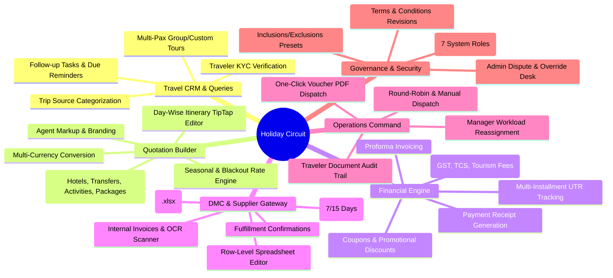
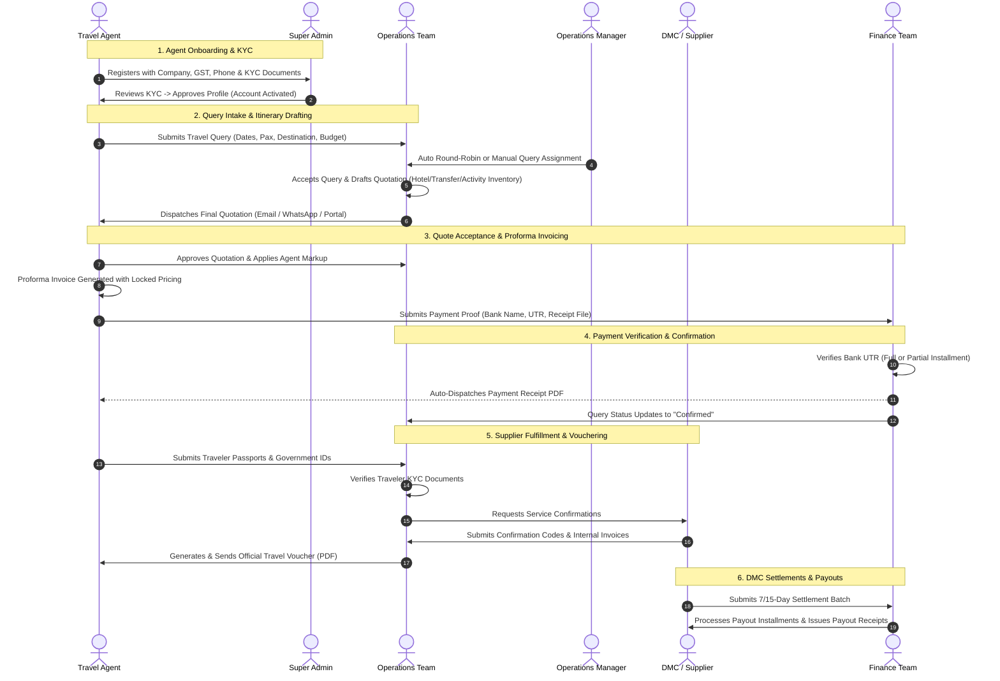
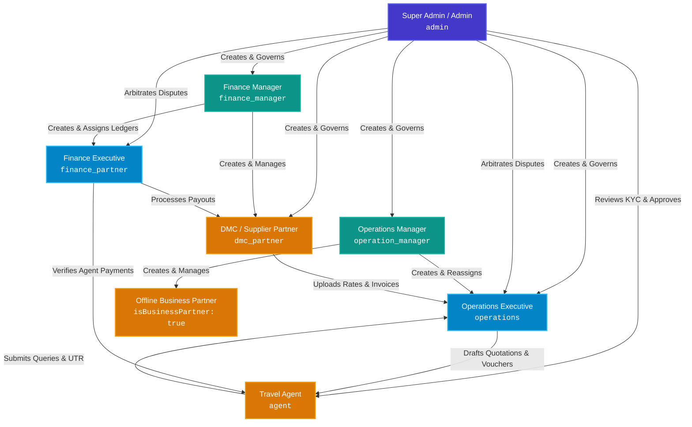
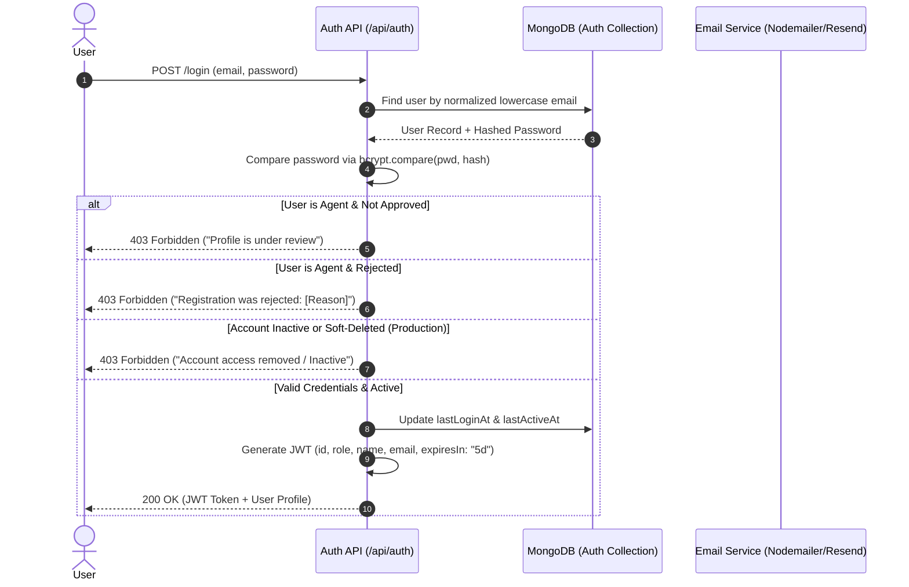
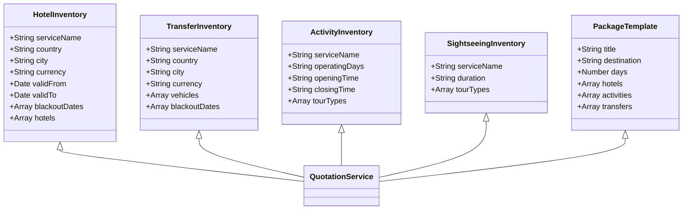
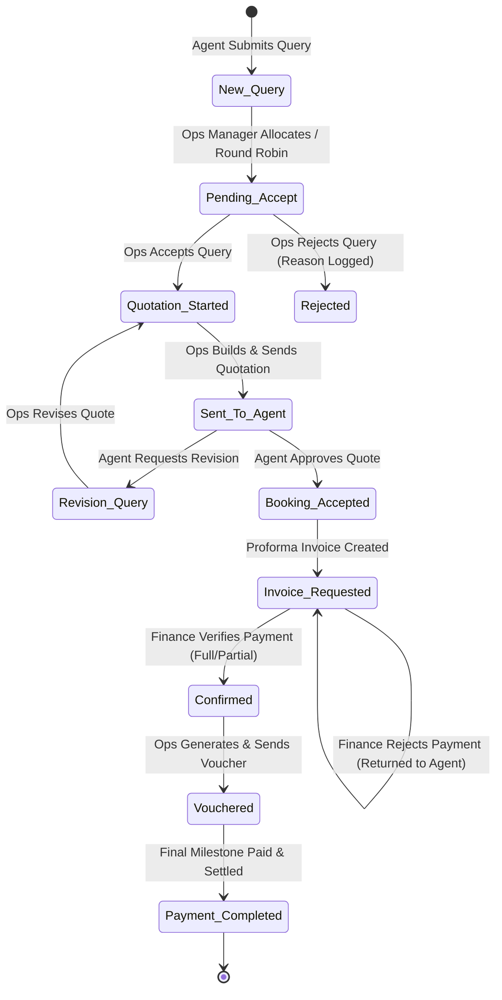

# Holiday Circuit 🌍✈️
> **Enterprise-Grade B2B Travel Operations, Quotation Engine & Multi-Portal ERP Platform**

[](#technology-stack)
[](#frontend-portals)
[](#backend-api)
[](#database-architecture)
[-orange.svg)](#multi-portal-ecosystem)

---

## 📌 Table of Contents
- [1. Project Overview](#1-project-overview)
- [2. Purpose & Problem Statement](#2-purpose--problem-statement)
- [3. Key Features & Capabilities](#3-key-features--capabilities)
- [4. Technology Stack](#4-technology-stack)
- [5. System Architecture & Multi-Portal Ecosystem](#5-system-architecture--multi-portal-ecosystem)
- [6. Project Folder Structure](#6-project-folder-structure)
- [7. Complete User Roles](#7-complete-user-roles)
- [8. Role Hierarchy & Governance](#8-role-hierarchy--governance)
- [9. Authentication System](#9-authentication-system)
- [10. Authorization & Security Model](#10-authorization--security-model)
- [11. Complete Permission Matrix](#11-complete-permission-matrix)
- [12. Data Visibility Matrix](#12-data-visibility-matrix)
- [13. Who Can Create What](#13-who-can-create-what)
- [14. Who Can View What](#14-who-can-view-what)
- [15. Who Can Edit What](#15-who-can-edit-what)
- [16. Who Can Delete What](#16-who-can-delete-what)
- [17. Who Can Approve or Reject What](#17-who-can-approve-or-reject-what)
- [18. Module Overview](#18-module-overview)
- [19. Dashboard Module](#19-dashboard-module)
- [20. User Management & Staff Governance](#20-user-management--staff-governance)
- [21. Hotel & Service Inventory Management](#21-hotel--service-inventory-management)
- [22. Room Category & Service Options Management](#22-room-category--service-options-management)
- [23. Room & Inventory Rate Management](#23-room--inventory-rate-management)
- [24. Dynamic Pricing Engine & Blackout Rules](#24-dynamic-pricing-engine--blackout-rules)
- [25. Search & Service Availability](#25-search--service-availability)
- [26. Travel Query & Booking Lifecycle](#26-travel-query--booking-lifecycle)
- [27. Quotation Pricing & Price Locking](#27-quotation-pricing--price-locking)
- [28. Payment Verification & Finance Ledger](#28-payment-verification--finance-ledger)
- [29. Invoice Module (Proforma, Final & Internal DMC)](#29-invoice-module-proforma-final--internal-dmc)
- [30. Document & Traveler KYC Management](#30-document--traveler-kyc-management)
- [31. Notifications & Real-Time Presence](#31-notifications--real-time-presence)
- [32. Reports & Financial Analytics](#32-reports--financial-analytics)
- [33. Status Lifecycle Reference](#33-status-lifecycle-reference)
- [34. Core Business Rules](#34-core-business-rules)
- [35. Role-Specific User Manuals](#35-role-specific-user-manuals)
- [36. Screen-by-Screen Guide](#36-screen-by-screen-guide)
- [37. API Architecture & Endpoint Reference](#37-api-architecture--endpoint-reference)
- [38. Database Schema & Mongoose Models](#38-database-schema--mongoose-models)
- [39. Common Operational Workflows](#39-common-operational-workflows)
- [40. Setup & Installation Guide](#40-setup--installation-guide)
- [41. Troubleshooting & Support](#41-troubleshooting--support)
- [42. Frequently Asked Questions (FAQ)](#42-frequently-asked-questions-faq)
- [43. Implementation Status](#43-implementation-status)
- [44. Documentation Gaps](#44-documentation-gaps)
- [45. Support & Maintenance](#45-support--maintenance)

---

## 1. Project Overview

- **Project Name**: Holiday Circuit
- **Platform Type**: B2B Travel ERP, Operations Command Center & Multi-Portal Distribution Ecosystem
- **Business Domain**: Travel, Destination Management (DMC), Wholesale Travel Distribution, Itinerary & Quotation Management, Invoicing, Supplier Reconciliations & Traveler Document Verification
- **Core Architecture**: Multi-Frontend Client Architecture connected to a unified Express 5 / Node.js 18+ REST API Engine and MongoDB Database

### Main Users
1. **Travel Agents (`agent`)**: Independent travel agencies, corporate travel planners, and tour operators who create client queries, customize white-labeled quotations with custom markups, generate proforma invoices, submit payment proofs (UTR/receipts), upload traveler KYC documents, and dispatch confirmed travel vouchers.
2. **Operations Team (`operations`)**: Tour coordinators and itinerary planners who accept incoming queries, construct customized multi-service itineraries (Hotels, Transfers, Activities, Sightseeing, Packages), apply operational markups/taxes, review traveler passport/ID documents, coordinate with suppliers, and generate digital travel vouchers.
3. **Operations Manager (`operation_manager`)**: Operational team leads who oversee the entire query pipeline, reassign team workloads, manage offline Business Partners (BP) and Trip Sources, create direct B2B/direct queries, and monitor team productivity.
4. **DMC Partners / Suppliers (`dmc_partner`)**: Destination Management Companies and ground suppliers who maintain contracted rate sheets (Hotels, Transport, Activities, Sightseeing, Packages) via manual entry or bulk Excel upload, submit fulfillment confirmations, upload internal supplier invoices, and track payout settlement batches.
5. **Finance Team (`finance_partner`)**: Financial executives who verify agent payment submissions against bank UTR records, process installment receipts, audit internal DMC invoices, and manage payment allocations.
6. **Finance Manager (`finance_manager`)**: Financial controllers who manage finance team members, assign ledger verification queues, oversee vendor ledgers, review escalated payment verifications, and monitor cash flow analytics.
7. **Super Admin / Admin (`admin`)**: Platform administrators who govern system users, review and approve agent onboarding KYC documents, manage global discounts and coupon campaigns, arbitrate override cases and dispute desks, configure standard terms and inclusions/exclusions presets, and monitor system-wide statistics.

---

## 2. Purpose & Problem Statement

### The Problem in Traditional B2B Travel Operations
Traditional B2B travel operations suffer from severe operational friction:
- Disconnected communication across emails, spreadsheets, and messaging apps.
- Slow quotation turnaround times leading to lost agent bookings.
- Error-prone manual rate calculations across multi-currency supplier contracts with fluctuating seasonal and blackout dates.
- Lack of financial accountability in tracking partial installment payments and verifying bank UTR numbers.
- Unstructured supplier confirmations and delays in issuing traveler vouchers.
- Fragmented traveler KYC document collection and verification.

### How Holiday Circuit Solves It
- **Unified Multi-Portal Workflow**: Connects Agents, Operations, DMCs, Finance, and Admins into a single synchronized state machine.
- **Dynamic Multi-Service Quotation Engine**: Assembles Hotels, Transfers, Activities, and Sightseeing into itemized, branded day-wise itineraries with real-time currency conversions, operational markups, agent markups, GST, TCS, and handling fees.
- **Locked Pricing Snapshots**: Guarantees that once a quote is finalized and converted into a proforma invoice, historical booking prices remain immutable even if suppliers update seasonal contracts.
- **Automated Verification & Auditing**: Strict two-way audit trails for agent payment proofs (UTR matching), supplier internal invoices (OCR data extraction), and traveler passport/ID reviews.
- **Automated Travel Voucher Engine**: Automatically transforms confirmed supplier bookings into branded or white-labeled travel vouchers with custom logos, emergency contacts, and skyline banners.

---

## 3. Key Features & Capabilities


```mermaid
mindmap
  root((Holiday Circuit))
    Travel CRM & Queries
      Multi-Pax Group/Custom Tours
      Trip Source Categorization
      Traveler KYC Verification
      Follow-up Tasks & Due Reminders
    Quotation Builder
      Multi-Service Catalog (Hotels, Transfers, Activities, Packages)
      Multi-Currency Conversion
      Seasonal & Blackout Rate Engine
      Day-Wise Itinerary TipTap Editor
      Agent Markup & Branding
    Financial Engine
      Proforma Invoicing
      Multi-Installment UTR Tracking
      Coupons & Promotional Discounts
      Payment Receipt Generation
      Tax Engine (GST, TCS, Tourism Fees)
    DMC & Supplier Gateway
      Bulk Excel Rates Ingestion (.xlsx)
      Row-Level Spreadsheet Editor
      Fulfillment Confirmations
      Internal Invoices & OCR Scanner
      Credit Period Batches (7/15 Days)
    Operations Command
      Round-Robin & Manual Dispatch
      Manager Workload Reassignment
      Traveler Document Audit Trail
      One-Click Voucher PDF Dispatch
    Governance & Security
      Granular RBAC (7 System Roles)
      Admin Dispute & Override Desk
      Terms & Conditions Revisions
      Inclusions/Exclusions Presets
```

---

## 4. Technology Stack

### Frontend Architecture
- **Framework**: React 19.2.0 (Single Page Application architecture across 5 dedicated workspaces: `Admin`, `Agent`, `OPS`, `DMC`, `Finance`)
- **Build Tool**: Vite 7 (ES Modules, HMR, Optimized Rollup bundling)
- **State Management**: Redux Toolkit (`@reduxjs/toolkit` 2.x) + `react-redux`
- **Routing**: `react-router-dom` 7.x with nested layouts and role-based `ProtectedRoute` guards
- **Styling**: Tailwind CSS v4, Vanilla CSS Design System, Custom Glassmorphism & Aurora UI Tokens
- **Icons & UI Enhancements**: `lucide-react`, `react-icons`, `framer-motion`
- **Rich Text Editing**: TipTap Editor (`@tiptap/react`, `@tiptap/starter-kit`, `@tiptap/extension-underline`)
- **Document & PDF Generation**: `html2pdf.js`, `jspdf`, `html2canvas`
- **Spreadsheet Processing**: `xlsx` (SheetJS), `exceljs`
- **Charts & Visual Analytics**: `recharts`
- **Notifications & Feedback**: `react-hot-toast`, `sweetalert2`

### Backend Architecture
- **Runtime**: Node.js 18+ (ES Modules: `"type": "module"`)
- **Framework**: Express 5 (`5.1.0`)
- **Database & ODM**: MongoDB + Mongoose 9 (`9.1.2`)
- **Authentication & Cryptography**: JSON Web Tokens (`jsonwebtoken` 9.x) with 5-day expiration, `bcrypt` 6.x (10 salt rounds)
- **File Upload & Storage**: `multer` 2.x (Local Disk Storage in `/uploads` + Cloudinary via `multer-storage-cloudinary` 4.x)
- **Document & PDF Processing**: `pdfkit`, `pdf-parse`, `mammoth` (DOCX parsing), `sharp` (image processing), `tesseract.js` (OCR text extraction)
- **Spreadsheet Engine**: `xlsx` (SheetJS 0.18.5)
- **Email Communications**: Multi-provider email engine supporting `smtp` (Nodemailer 7.x), `resend` (Resend SDK 6.x), and `brevo`
- **WhatsApp Communications**: Twilio SDK (`twilio` 5.x)
- **Security & Middlewares**: `cors`, `express-rate-limit`, `morgan`, custom `authMiddleware`, `roleMiddleware`, `errorHandler`

---

## 5. System Architecture & Multi-Portal Ecosystem

Holiday Circuit is structured into 5 independent frontend portals sharing a unified REST API backend:

```text
                                  ┌──────────────────────────────────────────────┐
                                  │           Holiday Circuit Database           │
                                  │               (MongoDB Atlas)                │
                                  └──────────────────────┬───────────────────────┘
                                                         │
                                  ┌──────────────────────┴───────────────────────┐
                                  │            Node.js / Express 5 API           │
                                  │                (server :3000)                │
                                  └──────┬───────┬───────┬───────┬───────┬───────┘
                                         │       │       │       │       │
              ┌──────────────────────────┘       │       │       │       └──────────────────────────┐
              │                                  │       │       │                                  │
    ┌─────────▼─────────┐              ┌─────────▼───────▼───────▼─────────┐              ┌─────────▼─────────┐
    │   Agent Portal    │              │         Operations Portal         │              │   Finance Portal  │
    │  (Port: 5173/5174)│              │        (Port: 5175/5176)          │              │  (Port: 5177/3000)│
    │  - agent          │              │  - operations                     │              │  - finance_partner│
    └───────────────────┘              │  - operation_manager              │              │  - finance_manager│
                                       └─────────────────┬─────────────────┘              └───────────────────┘
                                                         │
                                       ┌─────────────────┴─────────────────┐
                                       │                                   │
                             ┌─────────▼─────────┐               ┌─────────▼─────────┐
                             │    Admin Portal   │               │    DMC Portal     │
                             │  - admin          │               │  - dmc_partner    │
                             └───────────────────┘               └───────────────────┘
```

### End-to-End Business Flow Diagram


```mermaid
sequenceDiagram
    autonumber
    actor Agent as Travel Agent
    actor Admin as Super Admin
    actor Ops as Operations Team
    actor OpsMgr as Operations Manager
    actor DMC as DMC / Supplier
    actor Fin as Finance Team

    Note over Agent,Admin: 1. Agent Onboarding & KYC
    Agent->>Admin: Registers with Company, GST, Phone & KYC Documents
    Admin->>Agent: Reviews KYC -> Approves Profile (Account Activated)

    Note over Agent,Ops: 2. Query Intake & Itinerary Drafting
    Agent->>Ops: Submits Travel Query (Dates, Pax, Destination, Budget)
    OpsMgr->>Ops: Auto Round-Robin or Manual Query Assignment
    Ops->>Ops: Accepts Query & Drafts Quotation (Hotel/Transfer/Activity Inventory)
    Ops->>Agent: Dispatches Final Quotation (Email / WhatsApp / Portal)

    Note over Agent,Fin: 3. Quote Acceptance & Proforma Invoicing
    Agent->>Ops: Approves Quotation & Applies Agent Markup
    Agent->>Agent: Proforma Invoice Generated with Locked Pricing
    Agent->>Fin: Submits Payment Proof (Bank Name, UTR, Receipt File)

    Note over Fin,Ops: 4. Payment Verification & Confirmation
    Fin->>Fin: Verifies Bank UTR (Full or Partial Installment)
    Fin-->>Agent: Auto-Dispatches Payment Receipt PDF
    Fin->>Ops: Query Status Updates to "Confirmed"

    Note over Ops,DMC: 5. Supplier Fulfillment & Vouchering
    Agent->>Ops: Submits Traveler Passports & Government IDs
    Ops->>Ops: Verifies Traveler KYC Documents
    Ops->>DMC: Requests Service Confirmations
    DMC->>Ops: Submits Confirmation Codes & Internal Invoices
    Ops->>Agent: Generates & Sends Official Travel Voucher (PDF)

    Note over Fin,DMC: 6. DMC Settlements & Payouts
    DMC->>Fin: Submits 7/15-Day Settlement Batch
    Fin->>DMC: Processes Payout Installments & Issues Payout Receipts
```

---

## 6. Project Folder Structure

```text
Holiday circuit/
│
├── holiday-circuit/
│   ├── Admin/                                # Super Admin & Admin Frontend Portal (React 19 + Vite)
│   │   ├── src/
│   │   │   ├── auth/                         # Login & Registration views
│   │   │   ├── layout/                       # Header, Sidebar, DesktopNav, MobileNav, navConfig.js
│   │   │   ├── pages/
│   │   │   │   ├── adminPages/               # Dashboard, SuperAdminDashboard, UserManagement, Discount, OverrideDisputeDeskPage, Terms, IncExc
│   │   │   │   ├── opsPages/                 # Ops Dashboard, Order Acceptance, Quotation Builder, Packages, Vouchers
│   │   │   │   ├── dmcPages/                 # Contracted Rates, Fulfillment Confirmation, Settlement Center
│   │   │   │   ├── financePages/             # Finance Dashboard, Payment Verification, Internal Invoices, Analytics, Booking Statistics
│   │   │   │   └── managerPages/             # Ops Manager & Finance Manager sub-views
│   │   │   ├── redux/                        # Redux Toolkit store & auth slices
│   │   │   └── utils/                        # Axios API client, helpers, formatters
│   │   └── package.json
│   │
│   ├── Agent/                                # Travel Agent Frontend Portal (React 19 + Vite)
│   │   ├── src/
│   │   │   ├── auth/                         # Agent Login & Registration with Document Upload
│   │   │   ├── layout/                       # Header, Sidebar, Navigation Config
│   │   │   ├── pages/
│   │   │   │   └── agentPages/               # AgentDashboard, Queries, QueryDetails, ActiveBookings, DocumentPortal, Finance, AssetLibrary, Terms
│   │   │   ├── components/                   # Proforma Invoice modal, Traveler KYC modal, Payment submission modal, Task widgets
│   │   │   ├── utils/                        # Api.js, voucherTemplate.js, defaultLogoBase64.js
│   │   │   └── redux/                        # Auth & booking state management
│   │   └── package.json
│   │
│   ├── DMC/                                  # Destination Management Company & Supplier Portal (React 19 + Vite)
│   │   ├── src/
│   │   │   ├── layout/                       # Header, Sidebar, Navigation Config
│   │   │   ├── pages/
│   │   │   │   └── dmcPages/                 # DmcDashboard, ContractedRates (Bulk Upload), FulfillmentConfirmation, SettlementCenter, DmcPaymentLedger, InternalInvoice
│   │   │   ├── components/                   # Excel rate uploaders, row-level editors, OCR preview components
│   │   │   └── utils/                        # Api client & helpers
│   │   └── package.json
│   │
│   ├── Finance/                              # Finance Executive & Finance Manager Portal (React 19 + Vite)
│   │   ├── src/
│   │   │   ├── layout/                       # Header, Sidebar, Navigation Config
│   │   │   ├── pages/
│   │   │   │   ├── financePages/             # FinanceDashboard, PaymentVerification, InternalInvoice, AdvancedAnalytics
│   │   │   │   └── managerPages/             # FinanceManagerDashboard, AllTeamTransactions, InternalDMCInvoices, MyFinanceTeam
│   │   │   └── utils/                        # Api client, formatters, PDF dispatch triggers
│   │   └── package.json
│   │
│   ├── OPS/                                  # Operations Team & Operations Manager Portal (React 19 + Vite)
│   │   ├── src/
│   │   │   ├── layout/                       # Header, Sidebar, DesktopNav, MobileNav, navConfig.js
│   │   │   ├── pages/
│   │   │   │   ├── opsPages/                 # OpsDashboardContent, BookingManagementHub, OrderAcceptance, QuotationBuilder, CreatePackage, VoucherManagement, IncExc
│   │   │   │   └── managerPages/             # OperationManagerDashboard, AllTeamQueries, MyOperationTeam, BPManagement, AddNewQuery
│   │   │   └── utils/                        # Api.js, quotation calculus, voucher templates
│   │   └── package.json
│   │
│   ├── server/                               # Unified Express 5 REST API Backend
│   │   ├── src/
│   │   │   ├── configs/                      # db.config.js (MongoDB Mongoose connection)
│   │   │   ├── constants/                    # permissions.js (ALLOWED_PERMISSIONS & ROLE_DEFAULT_PERMISSIONS)
│   │   │   ├── controllers/
│   │   │   │   ├── adminController.js        # User governance, agent KYC approvals, dispute desk, payments, analytics
│   │   │   │   ├── agentController.js        # Auth, queries, tasks, traveler docs, quotation review, proforma invoice, UTR submissions
│   │   │   │   ├── opsController.js          # Order acceptance, quotation builder, itinerary drafting, traveler KYC reviews, voucher generator
│   │   │   │   ├── opsManagerController.js   # Workload reassignment, team KPIs, offline business partner & trip source management
│   │   │   │   ├── dmcController.js          # Inventory CRUD, confirmations, internal invoices, settlement batches
│   │   │   │   ├── bulkUploadController.js   # Excel spreadsheet parser, validation, row-level change logging
│   │   │   │   ├── financeManagerController.js# Finance team member management, vendor records, team allocations
│   │   │   │   ├── couponController.js       # Promotional coupon creation, assignment, validation & redemption
│   │   │   │   ├── adminTerms.controller.js  # Admin terms & conditions versioning
│   │   │   │   ├── adminIncExc.controller.js # Inclusions & exclusions presets
│   │   │   │   └── admin.bookingStatistics.controller.js # Vouchered booking statistics & query deep-dive
│   │   │   ├── middlewares/
│   │   │   │   ├── auth.middleware.js        # JWT Bearer token verification & user normalization
│   │   │   │   ├── role.middleware.js        # RBAC role verification guard
│   │   │   │   ├── multer.middlewares.js     # Multipart file upload handler (Local & Cloudinary)
│   │   │   │   ├── rateLimiter.js            # Express rate limiting
│   │   │   │   ├── error.middleware.js       # Centralized ApiError handler
│   │   │   │   └── asyncHandler.js           # Async controller wrapper
│   │   │   ├── models/                       # 28 Mongoose Data Models (Auth, TravelQuery, Quotation, Invoice, Voucher, etc.)
│   │   │   ├── routes/                       # Express router modules (`authRoute`, `admin.routes`, `agent.routes`, `ops.routes`, `dmcRoutes`, `financeManager.routes`)
│   │   │   ├── services/                     # Email, WhatsApp, PDFKit, OCR, Excel parsing, Notification dispatching, Finance scoping
│   │   │   └── utils/                        # ApiError, blackout date math, access expiry utilities, pdfCache
│   │   ├── uploads/                          # Local file storage directory for uploaded documents
│   │   ├── createAdmin.js                    # Super Admin database seed script
│   │   ├── index.js                          # Express application entry point & CORS configuration
│   │   └── package.json
│   │
│   └── README.md                             # Platform Documentation
```

---

## 7. Complete User Roles

The system contains 7 user roles stored in the `Auth` model (`role` enum) plus a specialized `isBusinessPartner` offline partner flag:


```mermaid
graph TD
    classDef adminClass fill:#4338ca,stroke:#6366f1,stroke-width:2px,color:#fff;
    classDef mgrClass fill:#0d9488,stroke:#14b8a6,stroke-width:2px,color:#fff;
    classDef staffClass fill:#0284c7,stroke:#38bdf8,stroke-width:2px,color:#fff;
    classDef extClass fill:#d97706,stroke:#f59e0b,stroke-width:2px,color:#fff;

    SA["Super Admin / Admin<br/><code>admin</code>"]:::adminClass
    OM["Operations Manager<br/><code>operation_manager</code>"]:::mgrClass
    FM["Finance Manager<br/><code>finance_manager</code>"]:::mgrClass
    OP["Operations Executive<br/><code>operations</code>"]:::staffClass
    FP["Finance Executive<br/><code>finance_partner</code>"]:::staffClass
    AG["Travel Agent<br/><code>agent</code>"]:::extClass
    DMC["DMC / Supplier Partner<br/><code>dmc_partner</code>"]:::extClass
    BP["Offline Business Partner<br/><code>isBusinessPartner: true</code>"]:::extClass

    SA -->|Creates & Governs| OM
    SA -->|Creates & Governs| FM
    SA -->|Creates & Governs| OP
    SA -->|Creates & Governs| DMC
    SA -->|Reviews KYC & Approves| AG
    SA -->|Arbitrates Disputes| OP
    SA -->|Arbitrates Disputes| FP

    OM -->|Creates & Reassigns| OP
    OM -->|Creates & Manages| BP
    FM -->|Creates & Assigns Ledgers| FP
    FM -->|Creates & Manages| DMC

    AG -->|Submits Queries & UTR| OP
    OP -->|Drafts Quotations & Vouchers| AG
    FP -->|Verifies Agent Payments| AG
    DMC -->|Uploads Rates & Invoices| OP
    FP -->|Processes Payouts| DMC
```

### Detailed Breakdown per Role

#### 1. Super Admin / Admin (`admin`)
- **Purpose**: System-wide governance, KYC approval of new travel agents, staff provisioning, promotional coupon configuration, override dispute arbitration, and financial analytics.
- **Created By**: Initialized via CLI seed script (`createAdmin.js`) or created by an existing Super Admin.
- **Approval Required**: No (Pre-approved / Active on creation).
- **Login Access**: Full login access via Admin Portal.
- **Accessible Dashboards**: Admin Dashboard, Super Admin Overview, Finance Dashboard, Advanced Analytics, Booking Statistics Hub.
- **Available Modules**: User Management, Agent KYC Approval Queue, Override & Dispute Desk, Discount & Coupons, Rate Contracts, Booking Management Hub, Order Acceptance, Create Package, Voucher Management, Booking Confirmation, Payment Verification, Internal Invoice Audit, Terms & Conditions Presets, Inclusions/Exclusions Presets.
- **Create Permissions**: Managed staff users (`admin`, `operations`, `dmc_partner`), coupons, rate contracts, terms & conditions presets, inclusion/exclusion presets.
- **View Permissions**: Global system-wide visibility across all queries, quotations, invoices, payments, staff users, agents, and DMC inventories.
- **Update Permissions**: Global update permissions; can edit user roles, permissions, account statuses, coupons, terms, presets, and resolve dispute overrides.
- **Delete Permissions**: Soft deletion and permanent deletion of managed users; deletion of coupons, rate contracts, terms, presets, and upload histories.
- **Approval Permissions**: Approves/rejects agent onboarding registrations, resolves escalated override cases, verifies payment transactions.

#### 2. Travel Agent (`agent`)
- **Purpose**: B2B customer interface for travel agencies to create client queries, customize quotations with dynamic agent markups, generate proforma invoices, submit payment receipts (UTR), manage traveler KYC documents, and dispatch branded travel vouchers.
- **Created By**: Self-registration via Agent Portal `/register` or created by Operations Manager / Admin as an offline agent profile.
- **Approval Required**: **YES**. Must be reviewed and approved by an Admin based on submitted GST, Business License, and contact data. Account remains `status: "pending"` and `accountStatus: "Inactive"` until approved.
- **Login Access**: Restricted to Agent Portal; login blocked if `status === "pending"`, `status === "rejected"`, `accountStatus === "Inactive"`, or `isDeleted: true`.
- **Accessible Dashboards**: Agent Dashboard (Query counts, conversion metrics, pending payments, due today tasks).
- **Available Modules**: Travel Queries, Query Details Workspace, Active Bookings & Invoices, Document Portal (Traveler Passports/IDs), Agent Finance Overview, Asset Library (Branding Logo & Footer), Custom Terms & Conditions.
- **Unavailable Modules**: Staff Management, Order Acceptance Queue, Supplier Rate Uploads, Payment Verification Queue, Internal DMC Invoices, Dispute Desk.
- **Create Permissions**: Travel queries, query follow-up tasks, traveler documents, custom terms & conditions.
- **View Permissions**: Strictly limited to their **own queries, own quotations, own proforma invoices, own traveler documents, and assigned coupons**.
- **Update Permissions**: Query specifications (before confirmation), quotation agent markup (percentage/amount), quotation branding details, traveler documents, task resolution.
- **Delete Permissions**: Own traveler documents (before verification), own query tasks, own terms & conditions.
- **Booking & Payment Permissions**: Accepts quotations, generates proforma invoices, uploads payment proof (UTR number, bank name, payment date, receipt file), applies discount coupons.

#### 3. Operations Executive (`operations`)
- **Purpose**: Core fulfillment coordinator responsible for accepting incoming queries, building multi-service itineraries and quotations, calculating dynamic markups and taxes, reviewing traveler KYC documents, coordinating with DMCs, and generating travel vouchers.
- **Created By**: Super Admin or Operations Manager.
- **Approval Required**: No (Created in `Active` status).
- **Login Access**: Operations Portal (`/ops/*`).
- **Accessible Dashboards**: OPS Dashboard (Pending acceptances, active bookings, quotation drafts, voucher readiness).
- **Available Modules**: Order Acceptance Queue, Quotation Builder (day-wise itinerary editor, hotel/transport/activity service catalog), Package Creator, Booking Management Hub, Voucher Management, Traveler KYC Review, Inclusions/Exclusions Presets, Offline Business Partner Invoicing.
- **Unavailable Modules**: Admin Dispute Desk, Agent KYC Approval, Staff Provisioning, Finance Manager Ledger Governance.
- **Create Permissions**: Quotations, quotation drafts, multi-service packages, travel vouchers, offline supplier confirmations, offline partner invoice uploads.
- **View Permissions**: Assigned queries, unassigned incoming order acceptance pool, all DMC contracted rates, traveler documents.
- **Update Permissions**: Query operational status, quotation line items, day-wise itineraries, operational markups, handling fees, taxes, blackout overrides (with warning logging), traveler KYC verification status (`Verified` / `Rejected`).
- **Approval Permissions**: Accepts/rejects incoming queries, verifies traveler passports/IDs, passes queries to Manager or Super Admin for arbitration.

#### 4. Operations Manager (`operation_manager`)
- **Purpose**: Operational supervisor governing the entire query pipeline, team query allocations, workload balancing, team KPI tracking, and management of offline Business Partners (BP) and Trip Sources.
- **Created By**: Super Admin.
- **Approval Required**: No.
- **Login Access**: Operations Portal (`/operationManager/*` and `/ops/*`).
- **Accessible Dashboards**: Operations Manager Dashboard (Workload distribution, team performance, bottleneck detection, revenue pipeline).
- **Available Modules**: All Team Queries, My Operation Team (Executive provisioning, query creation permission toggling, workload reassignment), Vendor / BP Management (offline suppliers), Trip Sources Directory, Add New Direct Query, Order Acceptance, Quotation Builder, Voucher Management.
- **Create Permissions**: Direct travel queries (B2B / Direct), operations team members, offline business partners, trip sources.
- **View Permissions**: System-wide operations visibility across all team members' queries, quotations, and activity logs.
- **Update Permissions**: Reassigns queries from one team member to another, updates team member designations/permissions, updates trip sources and offline partners.
- **Governance Permissions**: Arbitrates complex query escalations, approves blackout date override pricing.

#### 5. DMC / Supplier Partner (`dmc_partner`)
- **Purpose**: Destination Management Companies and ground vendors who supply contracted inventory (Hotels, Transfers, Activities, Sightseeing, Packages), confirm bookings, submit internal invoices, and track settlement payouts.
- **Created By**: Super Admin or Finance Manager.
- **Approval Required**: Created by Admin/Finance Manager.
- **Login Access**: DMC Portal (`/dmc/*`).
- **Accessible Dashboards**: DMC Dashboard (Active contracted services, pending confirmations, payout balances).
- **Available Modules**: Contracted Rates (Single entry & Bulk Excel rate sheet upload), Bulk Upload History & Row Editor, Booking Fulfillment Confirmations, Settlement Center (7/15-day batch builder), DMC Payment Ledger.
- **Unavailable Modules**: Agent Queries, Quotation Builder, Customer Invoices, Payment Verification Queue.
- **Create Permissions**: Hotel, Transfer, Activity, Sightseeing, and Package rate contracts; bulk Excel upload sheets; booking fulfillment confirmation references; internal DMC invoices; settlement batches.
- **View Permissions**: Strictly limited to their **own uploaded inventory, assigned booking fulfillment requests, own internal invoices, and settlement ledgers**.
- **Update Permissions**: Row-level rate editing in uploaded spreadsheets (with mandatory audit reason logging), fulfillment confirmation numbers, internal invoice drafts.
- **Delete Permissions**: Deletion of rate contracts linked to their own uploads.

#### 6. Finance Executive (`finance_partner`)
- **Purpose**: Financial auditor responsible for reviewing agent payment submissions, verifying bank UTR numbers against statement deposits, issuing payment receipts, auditing internal DMC invoices, and managing installment allocations.
- **Created By**: Finance Manager or Super Admin.
- **Approval Required**: No.
- **Login Access**: Finance Portal (`/finance/*`).
- **Accessible Dashboards**: Finance Dashboard (Receivables vs. Payables, overdue tracker, pending verifications).
- **Available Modules**: Payment Verification Queue (Agent UTR audits), Internal Invoice Audit (DMC supplier bills), Advanced Analytics (Tax summaries, monthly/yearly revenue).
- **Unavailable Modules**: Query Creation, Quotation Builder, Staff Management, DMC Rate Ingestion.
- **Create Permissions**: Payment receipt PDF dispatches, payout installment records.
- **View Permissions**: Assigned payment verifications (under manager's scoped team allocation) and internal invoices.
- **Update Permissions**: Verifies or rejects agent payment submissions (`Verified` / `Rejected`), logs rejection reasons, updates installment verification flags.
- **Approval Permissions**: Approves agent payment proofs (marking invoices `Partially Paid` or `Paid` and triggering booking confirmation), passes high-value verifications to Finance Manager.

#### 7. Finance Manager (`finance_manager`)
- **Purpose**: Head of finance overseeing team transaction queues, assigning ledgers, auditing vendor payouts, managing credit periods (7/15 days), managing finance team members, and reviewing escalated payment verifications.
- **Created By**: Super Admin.
- **Approval Required**: No.
- **Login Access**: Finance Portal (`/financeManager/*` and `/finance/*`).
- **Accessible Dashboards**: Finance Manager Dashboard (Total receivables, payables, net cash flow, tax breakdown, team audit KPIs).
- **Available Modules**: All Team Transactions, Internal DMC Invoices, My Finance Team (Staff creation & queue assignment), Vendor Ledgers (DMC vendor onboarding), Advanced Analytics.
- **Create Permissions**: Finance team members, DMC vendor records, batch settlement approvals, payout receipts.
- **View Permissions**: System-wide financial visibility across all agent invoices, payment proofs, internal supplier invoices, and team audit trails.
- **Update Permissions**: Final approval on escalated payment verifications, settlement batch payout approvals, finance team role/scope modifications.
- **Approval Permissions**: Final authority on internal DMC invoice approvals and vendor settlement disbursements.

#### 8. Offline Business Partner (`isBusinessPartner: true`)
- **Purpose**: Offline suppliers, transport contractors, and local tour operators managed directly by Operations or Admin without individual portal login accounts (`password: not required`).
- **Created By**: Operations Manager, Admin, or Finance Manager.
- **Login Access**: None (`isBusinessPartner: true`). Services and invoices are created on their behalf by Operations or Finance staff.

---

## 8. Role Hierarchy & Governance

```text
                               ┌─────────────────────────┐
                               │       Super Admin       │
                               │         (admin)         │
                               └────────────┬────────────┘
                                            │
                    ┌───────────────────────┴───────────────────────┐
                    │                                               │
        ┌───────────▼───────────┐                       ┌───────────▼───────────┐
        │  Operations Manager   │                       │    Finance Manager    │
        │  (operation_manager)  │                       │   (finance_manager)   │
        └───────────┬───────────┘                       └───────────┬───────────┘
                    │                                               │
        ┌───────────▼───────────┐                       ┌───────────▼───────────┐
        │ Operations Executive  │                       │   Finance Executive   │
        │     (operations)      │                       │   (finance_partner)   │
        └───────────┬───────────┘                       └───────────┬───────────┘
                    │                                               │
                    │               External Entities               │
                    ├───────────────────────┬───────────────────────┤
                    │                                               │
        ┌───────────▼───────────┐                       ┌───────────▼───────────┐
        │     Travel Agent      │                       │     DMC / Supplier    │
        │        (agent)        │                       │     (dmc_partner)     │
        └───────────────────────┘                       └───────────────────────┘
```

### Governance Principles
1. **User Creation Authority**:
   - `admin` can create `admin`, `operations`, `operation_manager`, `finance_manager`, `finance_partner`, `dmc_partner`.
   - `operation_manager` can create `operations` and offline `isBusinessPartner` vendors.
   - `finance_manager` can create `finance_partner` and `dmc_partner` vendors.
   - `agent` self-registers and requires `admin` approval.
2. **Deactivation & Soft Deletion**:
   - `admin` can activate, deactivate (`accountStatus: "Inactive"`), soft-delete (`isDeleted: true`), restore, or permanently delete managed staff users.
3. **Workload & Queue Allocation**:
   - Operations queries are distributed via Round-Robin or manually assigned by `operation_manager`.
   - Finance payment verification queues are scoped by `finance_manager` across `finance_partner` executives.

---

## 9. Authentication System

The authentication architecture is implemented via `server/src/routes/authRoute.js` and `server/src/controllers/agentController.js`:


```mermaid
sequenceDiagram
    autonumber
    actor User
    participant API as Auth API (/api/auth)
    participant DB as MongoDB (Auth Collection)
    participant Mail as Email Service (Nodemailer/Resend)

    User->>API: POST /login (email, password)
    API->>DB: Find user by normalized lowercase email
    DB-->>API: User Record + Hashed Password
    API->>API: Compare password via bcrypt.compare(pwd, hash)
    
    alt User is Agent & Not Approved
        API-->>User: 403 Forbidden ("Profile is under review")
    else User is Agent & Rejected
        API-->>User: 403 Forbidden ("Registration was rejected: [Reason]")
    else Account Inactive or Soft-Deleted (Production)
        API-->>User: 403 Forbidden ("Account access removed / Inactive")
    else Valid Credentials & Active
        API->>DB: Update lastLoginAt & lastActiveAt
        API->>API: Generate JWT (id, role, name, email, expiresIn: "5d")
        API-->>User: 200 OK (JWT Token + User Profile)
    end
```

### Authentication Mechanics
- **Registration (`POST /api/auth/register`)**:
  - Multipart form upload supporting up to 5 KYC document attachments (GST Certificate, Business License, etc.).
  - Password hashed using `bcrypt` (10 salt rounds).
  - Default status: `isApproved: false`, `status: "pending"`, `accountStatus: "Inactive"`.
  - Sends immediate email acknowledgement to agent and dispatches in-app notifications to all Admins.
  - Supports registration resubmission if previously rejected.
- **Login (`POST /api/auth/login`)**:
  - Validates email and bcrypt password hash.
  - Enforces account status checks: blocks unapproved agents, rejected agents, inactive accounts, soft-deleted accounts, and expired access accounts.
  - Issues signed JWT token with payload: `{ id, role, name, email }` valid for **5 days**.
- **Session Profile (`GET /api/auth/me`)**:
  - Protected endpoint decoding JWT Bearer token and returning user identity, permissions array, company details, credit days, and branding data.
- **Heartbeat & Online Tracking (`POST /api/auth/heartbeat`)**:
  - Invoked periodically by active frontend portals to refresh `lastActiveAt`.
  - Users with activity within the last 120 seconds (2 minutes) are marked as `isOnline: true` in user management tables.
- **Password Reset via OTP**:
  - `POST /api/auth/forgot-password/send-otp`: Generates 6-digit numeric OTP, hashes OTP into `resetPasswordOtpHash`, sets 10-minute expiry `resetPasswordOtpExpiry`, and dispatches branded email.
  - `POST /api/auth/forgot-password/verify-otp`: Validates plain OTP against stored hash and records `resetPasswordOtpVerifiedAt`.
  - `POST /api/auth/forgot-password/reset`: Validates OTP verification timestamp and updates password with a fresh bcrypt hash.
- **Password Change (`POST /api/auth/change-password`)**:
  - Authenticated user verifies current password before updating to a new 8+ character password.

---

## 10. Authorization & Security Model

Holiday Circuit enforces defense-in-depth across both backend middleware and frontend route guards:

### 1. Backend Middleware Enforcement
- **Authentication Middleware (`auth.middleware.js`)**: Validates `Authorization: Bearer <token>` header, verifies signature using `process.env.JWT_SECRET`, and normalizes `req.user = { ...decoded, id, _id }`.
- **Role Verification Middleware (`role.middleware.js`)**: `authorizeRoles(...allowedRoles)` intercepts requests and rejects unauthorized roles with `403 Forbidden`.
- **Payload & File Sanitization**:
  - Express JSON/URL-Encoded body size limit restricted to `25mb` (`process.env.REQUEST_BODY_LIMIT`).
  - Multer limits file counts and validates MIME types for PDF, DOCX, XLSX, and images (PNG, JPEG, WebP).
- **CORS Protection (`server/index.js`)**: Restricts incoming API requests strictly to approved domains and development origins (`localhost:5173` through `5177`).
- **Rate Limiting (`rateLimiter.js`)**: Protects against brute-force attacks on authentication endpoints.

### 2. Frontend Route Protection
- Every frontend application wraps private routes in `<ProtectedRoute allowedRoles={[...]} />`.
- Unauthenticated users are redirected to `/` (Login).
- Unauthorized roles attempting to access foreign route trees are denied rendering.

### 3. Data Isolation & Ownership Validation
- **Agent Isolation**: Backend query endpoints enforce `{ agent: req.user._id }`. Agents cannot query or view other agencies' data.
- **DMC Isolation**: DMC inventory, confirmation, and settlement endpoints enforce `{ supplier: req.user._id }` / `{ dmc: req.user._id }`.
- **Finance Scoping (`financeTeamScopeService.js`)**:
  - `admin` has global ledger visibility.
  - `finance_manager` sees all ledgers and transactions assigned to their managed team.
  - `finance_partner` is restricted to records explicitly assigned to them or unassigned team queues.

---

## 11. Complete Permission Matrix

| Module / Action | Super Admin (`admin`) | Ops Manager (`operation_manager`) | Operations (`operations`) | Finance Manager (`finance_manager`) | Finance Exec (`finance_partner`) | DMC Partner (`dmc_partner`) | Travel Agent (`agent`) |
| :--- | :---: | :---: | :---: | :---: | :---: | :---: | :---: |
| **System Dashboard** | ✅ | ✅ | ✅ | ✅ | ✅ | ✅ | ✅ |
| **User Management** | ✅ | ⚠️ (Team Only) | ❌ | ⚠️ (Team Only) | ❌ | ❌ | ❌ |
| **Agent KYC Approvals** | ✅ | ❌ | ❌ | ❌ | ❌ | ❌ | ❌ |
| **Dispute & Override Desk** | ✅ | ⚠️ (Escalate) | ⚠️ (Escalate) | ⚠️ (Escalate) | ❌ | ❌ | ❌ |
| **Coupons & Discounts** | ✅ | ⚠️ (If Permitted) | ⚠️ (If Permitted) | ⚠️ (If Permitted) | ❌ | ❌ | 👁️ (Redeem) |
| **Travel Query Intake** | ✅ | ✅ | ⚠️ (If Permitted) | ❌ | ❌ | ❌ | ✅ |
| **Order Acceptance Queue** | ✅ | ✅ | ✅ | ❌ | ❌ | ❌ | ❌ |
| **Quotation Builder** | ✅ | ✅ | ✅ | ❌ | ❌ | ❌ | 👁️ (Review) |
| **Agent Markup & Branding** | ❌ | ❌ | ❌ | ❌ | ❌ | ❌ | ✅ |
| **Proforma Invoice Gen.** | ✅ | ✅ | ✅ | 👁️ | 👁️ | ❌ | ✅ (Auto) |
| **Traveler KYC Review** | ✅ | ✅ | ✅ | ❌ | ❌ | ❌ | ⚠️ (Upload) |
| **Voucher Generation** | ✅ | ✅ | ✅ | ❌ | ❌ | ❌ | 👁️ (Download) |
| **DMC Rate Bulk Upload** | ✅ | ❌ | ❌ | ❌ | ❌ | ✅ | ❌ |
| **Spreadsheet Row Editor** | ✅ | ❌ | ❌ | ❌ | ❌ | ✅ (Own) | ❌ |
| **Supplier Confirmations** | ✅ | ⚠️ (Offline) | ⚠️ (Offline) | ❌ | ❌ | ✅ (Own) | ❌ |
| **Payment UTR Submission** | ❌ | ❌ | ❌ | ❌ | ❌ | ❌ | ✅ |
| **Payment Verification** | ✅ | ❌ | ❌ | ✅ | ✅ | ❌ | ❌ |
| **Payment Receipt Dispatch**| ✅ | ❌ | ❌ | ✅ | ✅ | ❌ | 👁️ (Receive) |
| **Internal DMC Invoices** | ✅ | ❌ | ⚠️ (Offline) | ✅ | ✅ | ✅ (Own) | ❌ |
| **DMC Settlement Batches** | ✅ | ❌ | ❌ | ✅ | ✅ | ✅ (Own) | ❌ |
| **Terms & Conditions Preset**| ✅ | ❌ | ❌ | ❌ | ❌ | ❌ | ⚠️ (Custom) |
| **Inclusions/Exclusions** | ✅ | ✅ | ✅ | ❌ | ❌ | ❌ | 👁️ (In Quote) |

*Legend: ✅ = Allowed | ❌ = Forbidden | ⚠️ = Conditional / Role Scoped / Approval Required | 👁️ = View Only / Beneficiary*

---

## 12. Data Visibility Matrix

| Entity | `admin` | `operation_manager` | `operations` | `finance_manager` | `finance_partner` | `dmc_partner` | `agent` |
| :--- | :--- | :--- | :--- | :--- | :--- | :--- | :--- |
| **Travel Queries** | All Records | All Team Queries | Assigned + Pool | ❌ | ❌ | ❌ | Own Records Only |
| **Quotations** | All Records | All Team Quotes | Created / Assigned | ❌ | ❌ | ❌ | Own Records Only |
| **Proforma Invoices** | All Records | All Invoices | All Invoices | All Invoices | Scoped Queue | ❌ | Own Records Only |
| **Traveler Passports/IDs** | All Records | All Records | Assigned Queries | ❌ | ❌ | ❌ | Own Travelers |
| **DMC Rate Sheets** | All Inventories | All Inventories | All Inventories | ❌ | ❌ | Own Inventory | ❌ (View in Quote) |
| **Internal DMC Invoices** | All Records | ❌ | Offline BP Invoices | All Team Invoices | Assigned Queue | Own Invoices | ❌ |
| **Payment Proofs (UTR)** | All Records | ❌ | ❌ | All Transactions | Scoped Queue | ❌ | Own Submissions |
| **Travel Vouchers** | All Records | All Records | All Generated | ❌ | ❌ | Assigned Bookings | Own Confirmed |
| **Coupons & Codes** | All Records | If Granted | If Granted | If Granted | ❌ | ❌ | Assigned Only |

---

## 13. Who Can Create What

| Entity | Created By (Roles) | Approval Required | Approved By | Backend Controller & Endpoint |
| :--- | :--- | :---: | :---: | :--- |
| **Travel Agent User** | Self Registration (`agent`) | **YES** | `admin` | `POST /api/auth/register` (`registerAgent`) |
| **Operations Staff** | `admin`, `operation_manager` | No | - | `POST /api/admin/managed-users`, `POST /api/ops/manager/team` |
| **Finance Staff** | `admin`, `finance_manager` | No | - | `POST /api/admin/managed-users`, `POST /api/finance-manager/team` |
| **DMC Partner User** | `admin`, `finance_manager` | No | - | `POST /api/admin/create-dmc`, `POST /api/finance-manager/vendors` |
| **Offline Partner (BP)** | `operation_manager`, `admin` | No | - | `POST /api/admin/managed-users` (`isBusinessPartner: true`) |
| **Trip Source Record** | `operation_manager` | No | - | `POST /api/ops/manager/trip-sources` (`createTripSource`) |
| **Travel Query** | `agent`, `operation_manager`, `operations`* | No | - | `POST /api/agent/queries`, `POST /api/ops/manager/queries` |
| **Quotation & Itinerary** | `operations`, `operation_manager`, `admin` | **YES** (Agent) | `agent` | `POST /api/ops/quotations` (`createQuotation`) |
| **Quotation Draft** | `operations` | No | - | `PUT /api/ops/quotations/:quotationId/draft` |
| **Proforma Invoice** | Auto on Quote Accept / `agent` / `ops` | No | - | `POST /api/agent/quotations/:id/ensure-invoice` |
| **Traveler KYC Upload** | `agent` | **YES** | `operations` | `PUT /api/agent/queries/:id/travelers/:tId/document` |
| **DMC Rate Sheet (.xlsx)**| `dmc_partner`, `admin` | No | - | `POST /api/dmc/bulk-upload` (`bulkUpload`) |
| **Supplier Confirmation** | `dmc_partner` (Online), `ops` (Offline) | No | - | `POST /api/dmc/confirmation`, `POST /api/ops/vouchers/offline-confirmation` |
| **Payment Submission** | `agent` | **YES** | `finance_partner` / `admin` | `PUT /api/agent/invoices/:id/payment-status` |
| **Internal DMC Invoice** | `dmc_partner`, `ops` (BP), `admin` | **YES** | `finance_partner` / `finance_manager` | `POST /api/dmc/internal-invoice`, `POST /api/ops/business-partner-invoices/upload` |
| **Settlement Batch** | `dmc_partner` | **YES** | `finance_manager` | `POST /api/dmc/settlement-batches` (`submitDmcSettlementBatch`) |
| **Travel Voucher (PDF)** | `operations`, `operation_manager`, `admin` | No | - | `PATCH /api/ops/vouchers/:id/generate` (`generateVoucher`) |
| **Promotional Coupon** | `admin` | No | - | `POST /api/admin/coupons` (`createCoupon`) |
| **Terms & Conditions** | `admin` (System Preset), `agent` (Custom)| No | - | `POST /api/admin/terms`, `POST /api/agent/terms` |
| **Inc/Exc Preset** | `admin`, `operations` | No | - | `POST /api/admin/inc-exc-presets` (`createIncExcPreset`) |

*\*Note: Operations executives require explicit manager permission (`toggle-query-permission`) to create direct queries.*

---

## 14. Who Can View What

1. **Travel Agents (`agent`)**:
   - Strictly restricted to queries created by their own authenticated user ID (`agent: req.user._id`).
   - Can view quotation details sent to them, but supplier cost breakups and operational markups are masked.
   - Can view proforma invoices, payment verification statuses, and download final vouchers.
2. **Operations Staff (`operations`)**:
   - Can view all incoming queries in the unassigned Order Acceptance queue.
   - Can view queries assigned directly to them (`assignedTo: req.user._id`).
   - Can view all DMC contracted inventory across Hotels, Transfers, Activities, Sightseeing, and Packages to build itineraries.
3. **Operations Manager (`operation_manager`)**:
   - Global visibility across all operations team queries, quotation histories, reassignment logs, and performance metrics.
4. **DMC Partners (`dmc_partner`)**:
   - Strictly isolated to their own contracted rates, uploaded spreadsheets, assigned booking fulfillment requests, and internal invoice ledgers. Cannot view customer details, agent markups, or competing DMC inventories.
5. **Finance Team (`finance_partner` & `finance_manager`)**:
   - View agent proforma invoices, bank UTR submission receipts, internal supplier invoices, and cash flow reports.
6. **Super Admin (`admin`)**:
   - Global read visibility across every database collection and system audit log.

---

## 15. Who Can Edit What

| Entity | Editable By | Editable Fields | Restrictions & Status Locks |
| :--- | :--- | :--- | :--- |
| **Travel Query** | `agent` (Owner), `operation_manager`, `ops` | Dates, Destination, Pax split, Hotel category, Special requirements | **Locked** once query moves to `Confirmed`, `Vouchered`, or `Payment_Completed`. |
| **Quotation** | `operations`, `operation_manager`, `admin` | Services, Day-wise Itinerary, Operational Markup, Handling Fee, Taxes | **Locked** once accepted by agent (`Quote Accepted` / `Confirmed`). Subsequent edits require formal revision (`Revised`). |
| **Agent Markup** | `agent` (Owner) | Agent Markup Type (`PERCENT` / `AMOUNT`), Markup Value | Modifiable only before final booking confirmation. |
| **Traveler KYC** | `agent` | Traveler name, type, passport/ID files | **Locked** once reviewed and marked `Verified` by Operations. |
| **DMC Rate Sheet** | `dmc_partner` (Owner), `admin` | Row-level rates, seasonal prices, blackout dates in uploaded Excel | Requires mandatory audit change reason (`reasonType`, `reasonNote`). |
| **Payment Status** | `finance_partner`, `finance_manager`, `admin` | Payment Verification Status, Installment Verification, Finance Remarks | Once marked `Verified`, transaction record becomes immutable in audit trail. |
| **Staff User Profile**| `admin` (All), `operation_manager` (Ops Team), `finance_manager` (Finance Team) | Designation, Department, Permissions, Account Status (`Active`/`Inactive`), Access Expiry | Super Admin primary account cannot be deactivated. |

---

## 16. Who Can Delete What

| Entity | Deleted By | Deletion Type | Authorization & Constraints |
| :--- | :--- | :---: | :--- |
| **Managed Staff User** | `admin` | **Soft Delete** / **Hard Delete** | Soft delete updates `isDeleted: true`, `accountStatus: "Inactive"`. Permanent hard delete only available via `/api/admin/managed-users/:id/permanent`. |
| **Travel Query** | Not deletable via UI | Soft State (`Rejected`) | Queries are archived through status transitions (`Rejected`) to maintain operational audit integrity. |
| **Quotation Service Item**| `operations`, `ops_manager` | **Hard Delete** | Can remove individual service items from a quotation draft before quote finalization (`DELETE /api/ops/quotations/:id/services/:serviceId`). |
| **Multi-Service Package**| `operations`, `dmc_partner`, `admin`| **Hard Delete** | Deletes custom package template (`DELETE /api/ops/package/:id`). |
| **DMC Uploaded File** | `dmc_partner` (Owner), `admin` | **Hard Delete** (Scoped) | Deletes uploaded rate sheet file and cascades delete only to inventory tracked by that specific upload (`sourceUpload` match). |
| **Traveler KYC Document**| `agent` (Owner) | **Hard Delete** | Permitted only while verification status is `Draft` or `Rejected` (`DELETE /api/agent/queries/:qId/travelers/:tId/document/:key`). |
| **Promotional Coupon** | `admin` | **Hard Delete** | Permitted if coupon is unredeemed (`DELETE /api/admin/coupons/:id`). |
| **Terms & Conditions Preset**| `admin` (Preset), `agent` (Custom) | **Hard Delete** | Deletes term template (`DELETE /api/admin/terms/:id`, `DELETE /api/agent/terms/:id`). |
| **Inc/Exc Preset** | `admin`, `operations` | **Hard Delete** | Deletes inclusion/exclusion preset (`DELETE /api/admin/inc-exc-presets/:id`). |
| **Query Task** | `agent` (Author) | **Hard Delete** | Deletes follow-up task (`DELETE /api/agent/query-tasks/:taskId`). |

---

## 17. Who Can Approve or Reject What


```mermaid
graph TD
    classDef approve fill:#15803d,stroke:#22c55e,stroke-width:2px,color:#fff;
    classDef reject fill:#b91c1c,stroke:#ef4444,stroke-width:2px,color:#fff;
    classDef entity fill:#1e293b,stroke:#64748b,stroke-width:2px,color:#fff;

    A1[Agent Registration KYC]:::entity -->|Admin Review| A2{Approved?}
    A2 -->|Yes| A3[Status: approve / Active]:::approve
    A2 -->|No| A4[Status: rejected / Inactive<br/>Reason Emailed]:::reject

    B1[Incoming Travel Query]:::entity -->|Ops Review| B2{Accepted?}
    B2 -->|Yes| B3[opsStatus: Pending_Accept -> Quotation Started]:::approve
    B2 -->|No| B4[opsStatus: Rejected / Rejection Note]:::reject

    C1[Operations Quotation]:::entity -->|Agent Review| C2{Accepted?}
    C2 -->|Yes| C3[status: Quote Accepted -> Proforma Invoice]:::approve
    C2 -->|Revision| C4[status: Revision Requested -> Ops Queue]:::reject

    D1[Traveler Passports/IDs]:::entity -->|Ops Review| D2{Verified?}
    D2 -->|Yes| D3[status: Verified]:::approve
    D2 -->|Issues| D4[status: Rejected / Issue Flags Emailed]:::reject

    E1[Agent Payment Proof / UTR]:::entity -->|Finance Review| E2{Verified?}
    E2 -->|Yes| E3[paymentStatus: Paid / Partially Paid<br/>Receipt PDF Emailed]:::approve
    E2 -->|No| E4[paymentStatus: Unpaid / Rejection Remarks]:::reject

    F1[Internal DMC Invoice]:::entity -->|Finance Manager| F2{Approved?}
    F2 -->|Yes| F3[status: Approved -> Payout Scheduled]:::approve
    F2 -->|No| F4[status: Rejected / Returned to DMC]:::reject

    G1[Admin Override Case]:::entity -->|Super Admin| G2{Resolution}
    G2 -->|Overridden| G3[status: Overridden]:::approve
    G2 -->|Rejected| G4[status: Rejected]:::reject
```

### Approval Lifecycle Specifications

1. **Agent Registration KYC Approval**:
   - **Reviewer**: Super Admin (`admin`).
   - **Pre-Status**: `status: "pending"`, `isApproved: false`, `accountStatus: "Inactive"`.
   - **Post-Approval**: `status: "approve"`, `isApproved: true`, `accountStatus: "Active"`. Welcome email with login link sent automatically.
   - **Post-Rejection**: `status: "rejected"`, `isApproved: false`, `accountStatus: "Inactive"`. Rejection reason recorded and emailed to agent. Agent can log in to resubmit corrected documents.
2. **Travel Query Acceptance**:
   - **Reviewer**: Operations (`operations`) or Ops Manager (`operation_manager`).
   - **Pre-Status**: `opsStatus: "New_Query"` / `"Pending_Accept"`.
   - **Post-Approval**: `opsStatus: "Pending_Accept"` -> triggers quotation drafting workspace.
   - **Post-Rejection**: `opsStatus: "Rejected"`, `agentStatus: "Rejected"`. Rejection note logged.
3. **Quotation Approval**:
   - **Reviewer**: Travel Agent (`agent`).
   - **Pre-Status**: `quotation.status: "Quote Sent"`, `query.quotationStatus: "Sent_To_Agent"`.
   - **Post-Approval**: `quotation.status: "Quote Accepted"`, `query.agentStatus: "Client Approved"`. Automatically instantiates proforma invoice.
   - **Revision Request**: `quotation.status: "Revision Requested"`, `query.agentStatus: "Revision Requested"`, `query.opsStatus: "Revision_Query"`. Revision remarks routed back to Operations.
4. **Traveler Document KYC Verification**:
   - **Reviewer**: Operations (`operations`).
   - **Pre-Status**: `travelerDocumentVerification.status: "Pending"`.
   - **Post-Approval**: `status: "Verified"`. Unlocks travel voucher generation.
   - **Post-Rejection**: `status: "Rejected"`. Specific document issue flags recorded and notification dispatched to Agent.
5. **Payment Verification (UTR Audit)**:
   - **Reviewer**: Finance Executive (`finance_partner`) or Super Admin (`admin`).
   - **Pre-Status**: `invoice.paymentVerification.status: "Pending"`.
   - **Post-Approval**: `paymentVerification.status: "Verified"`. `invoice.paymentStatus` updated to `"Paid"` (if full) or `"Partially Paid"` (if milestone installment). `query.opsStatus` updated to `"Confirmed"` or `"Payment_Completed"`. Auto-generates and emails official Payment Receipt PDF.
   - **Post-Rejection**: `paymentVerification.status: "Rejected"`. `invoice.paymentStatus` reverts to `"Unpaid"`. Rejection remarks logged and agent notified.
6. **Internal DMC Invoice & Settlement Approval**:
   - **Reviewer**: Finance Manager (`finance_manager`).
   - **Pre-Status**: `internalInvoice.status: "Submitted"` / `"In Review"`.
   - **Post-Approval**: `status: "Approved"` -> Payout installment tracking initiated.
   - **Post-Rejection**: `status: "Rejected"`. Rejection notes logged.

---

## 18. Module Overview

| Module | Core Purpose | Primary Roles | Key Data Entities |
| :--- | :--- | :--- | :--- |
| **1. Dashboard** | Role-tailored KPI telemetry, real-time workload monitoring & financial charts | All 7 Roles | `TravelQuery`, `Invoice`, `Auth`, `InternalInvoice` |
| **2. User Management** | Staff provisioning, RBAC permission toggles, agent KYC approvals & soft delete | `admin`, `operation_manager`, `finance_manager` | `Auth`, `adminAccessRole` |
| **3. Travel CRM & Queries**| Multi-pax intake, domestic/international routing, group/custom tour intake | `agent`, `operations`, `operation_manager` | `TravelQuery`, `TripSource`, `destinationName` |
| **4. Quotation Builder** | Multi-service itinerary builder, dynamic markup engine, TipTap rich text | `operations`, `operation_manager`, `agent` | `Quotation`, `QuotationDraft`, `Hotel`, `Transfer` |
| **5. Proforma & Billing** | Locked pricing snapshots, dynamic seller tax resolution, agent markups | `agent`, `finance_partner`, `operations` | `Invoice`, `Coupon` |
| **6. DMC Contract Rates** | Multi-currency service catalogue, bulk Excel sheet ingestion, row editor | `dmc_partner`, `admin` | `Hotel`, `Transfer`, `Activity`, `UploadHistory` |
| **7. Traveler KYC Portal** | Passport/ID uploads, issue flagging, two-way audit trail & verification | `agent`, `operations` | `TravelQuery.travelerDetails` |
| **8. Supplier Confirmations**| Service booking codes, emergency contacts, offline supplier vouchers | `dmc_partner`, `operations` | `Confirmation`, `Voucher` |
| **9. Payment Verification**| Bank UTR matching, partial installment tracking, digital receipt dispatch | `finance_partner`, `finance_manager`, `agent` | `Invoice.paymentSubmission`, `Invoice.paymentAuditTrail` |
| **10. Supplier Settlements**| 7/15-day credit batches, OCR invoice extraction, payout installment logs | `dmc_partner`, `finance_manager` | `InternalInvoice`, `DmcSettlementBatch` |
| **11. Voucher Engine** | PDF voucher compilation, white-label branding, skyline footer layout | `operations`, `agent` | `Voucher`, `Quotation` |
| **12. Dispute & Override** | Escalated operational & financial arbitration desk for Super Admin | `admin`, `operation_manager`, `operations` | `AdminOverrideCase`, `TravelQuery.adminCoordination` |
| **13. Coupons & Discounts**| Promotional discount codes, percentage/flat discounts, agent assignment | `admin`, `agent` | `Coupon`, `Invoice` |
| **14. Presets (Terms/IncExc)**| Standardized policy templates & inclusion/exclusion lists with versioning | `admin`, `operations`, `agent` | `AdminTerm`, `AgentTerm`, `AdminIncExc` |

---

## 19. Dashboard Module

Each portal features a dashboard tailored to the operational KPIs of the logged-in role:

### 1. Super Admin & Admin Dashboard (`/admin/dashboard`, `/admin/superAdminDashboard`)
- **KPI Metrics**: Total Revenue, Total Bookings, Active Travel Agents, Pending KYC Approvals, Overdue Payments, Open Dispute Cases.
- **Charts & Telemetry**: Monthly Revenue vs. DMC Cost Outward, Destination Performance Bar Chart, Booking Conversion Ratio.
- **Action Hubs**: Direct access to Agent Approvals Queue, Managed Users, Dispute Overrides, and System Audit Logs.

### 2. Travel Agent Dashboard (`/agent/dashboard`)
- **KPI Cards**: Total Queries Created, Quotations Awaiting Review, Confirmed Bookings, Pending Payment Due Amount.
- **Task Widgets**: Due Today follow-up tasks, overdue client reminders, quick query intake launcher.
- **Recent Pipeline**: Live table of recent travel queries with real-time status badges (`Pending`, `Quote Sent`, `Confirmed`).

### 3. Operations Dashboard (`/ops/dashboard`)
- **KPI Cards**: New Unassigned Queries, Pending Quotation Drafts, Confirmed Bookings Awaiting Vouchers, Traveler Document KYC Queue.
- **Workload Queue**: Priority table of incoming queries categorized by travel departure proximity and destination region.
- **Activity Stream**: Live timestamped audit log of quote dispatches, agent approvals, and document uploads.

### 4. Operations Manager Dashboard (`/operationManager/operationManagerDashboard`)
- **KPI Cards**: Team Query Volume, Unallocated Pool Count, Average Quotation Turnaround Time, Executive Workload Balance Index.
- **Reassignment Workspace**: Interactive workload redistribution widget to reallocate queries from overloaded executives.
- **Trip Source Breakdown**: B2B Agent vs. Direct Enquiry performance metrics.

### 5. DMC Supplier Dashboard (`/dmc/dashboard`)
- **KPI Cards**: Active Contracted Rates, Pending Booking Confirmations, Total Claimed Invoices, Upcoming Payout Receivables.
- **Quick Upload Widget**: Dropzone for `.xlsx` rate sheets with upload history status (`processing`, `success`, `failed`).
- **Settlement Telemetry**: Credit period countdown (7 / 15 days) and payout installment tracker.

### 6. Finance Dashboard & Finance Manager Dashboard (`/finance/dashboard`, `/financeManager/financeManagerDashboard`)
- **KPI Cards**: Total Receivables (Agent Payments), Total Payables (DMC Internal Invoices), Verified Installments This Month, Overdue Unpaid Ledger.
- **Cash Flow Graph**: Inward Agent Collections vs. Outward Supplier Disbursements.
- **Tax Breakdown**: GST Collected, TCS Collected, Tourism Fees Breakdown.

---

## 20. User Management & Staff Governance

The User Management module (`/admin/user-management`) provides end-to-end administration of system accounts:

```text
User Management Workspace
├── User Directory Table (Search by Name/Email/EmpID, Filter by Role/Status/Department)
├── Staff Provisioning Modal (Auto/Manual Password, Expiry Date, Granular Permissions)
├── Agent KYC Approval Center (Document Inspection, GST Verification, One-Click Approval/Rejection)
├── Real-Time Presence Monitor (Active within 120s = Online Indicator)
└── Governance Actions (Status Toggle Active/Inactive, Soft Delete, Restore, Hard Delete)
```

### Core Capabilities
- **Staff Provisioning**: Create `admin`, `operations`, `operation_manager`, `finance_manager`, `finance_partner`, `dmc_partner`, and offline `isBusinessPartner` profiles.
- **Granular RBAC Permissions (`ALLOWED_PERMISSIONS`)**:
  - Administration: `Manage Users`, `System Config`, `Override`.
  - Operations: `Manage Booking`, `Create Query`, `Query Create`, `Add Query`.
  - Finance: `Approve Payments`, `Reject Payment`, `Submit Invoice`, `Manage Verifications`.
  - General & Discounts: `View`, `Edit`, `Export`, `Delete`, `Manage Discounts`, `Discount`.
- **Agent KYC Approval Workspace**: Displays submitted agent legal documents (GST Certificate, Business License) in a high-resolution previewer with one-click approval or rejection (with mandatory rejection reason).
- **Soft Deletion & Recovery**: Soft-deleted accounts have their status set to `accountStatus: "Inactive"`, `isDeleted: true`, preventing login while preserving historical audit relationships in invoices and queries. Admins can restore accounts or execute permanent deletion.

---

## 21. Hotel & Service Inventory Management

Holiday Circuit supports comprehensive multi-service catalog management across 5 service categories:


```mermaid
classDiagram
    class HotelInventory {
        +String serviceName
        +String country
        +String city
        +String currency
        +Date validFrom
        +Date validTo
        +Array blackoutDates
        +Array hotels
    }
    class TransferInventory {
        +String serviceName
        +String country
        +String city
        +String currency
        +Array vehicles
        +Array blackoutDates
    }
    class ActivityInventory {
        +String serviceName
        +String operatingDays
        +String openingTime
        +String closingTime
        +Array tourTypes
    }
    class SightseeingInventory {
        +String serviceName
        +String duration
        +Array tourTypes
    }
    class PackageTemplate {
        +String title
        +String destination
        +Number days
        +Array hotels
        +Array activities
        +Array transfers
    }

    HotelInventory <|-- QuotationService
    TransferInventory <|-- QuotationService
    ActivityInventory <|-- QuotationService
    SightseeingInventory <|-- QuotationService
    PackageTemplate <|-- QuotationService
```

### Service Categories
1. **Hotels (`Dmc_Hotel`)**: Contracted hotel rates categorized by Star rating (`3 Star`, `4 Star`, `5 Star`, `Luxury`), city, country, validity dates, seasonal rates (S1, S2, S3), room categories, bed types, meal plans (`EP`, `CP`, `MAP`, `AP`, `AI`), extra adult rates (`awebRate`), child with bed (`cwebRate`), and child without bed (`cwoebRate`).
2. **Transfers (`Dmc_Transfers`)**: Vehicle types (Sedan, SUV, Van, Coach), passenger/luggage capacities, usage options (`point-to-point`, `half-day`, `full-day`, `round-trip`), and extra km rates.
3. **Activities (`Dmc_Activity`)**: Tour options (`Group Tour`, `Private Tour`, `Ticket Only`), operating days, time slots, duration, pricing basis (`Per Pax` / `Per Group`), adult/child rates, and seasonal pricing.
4. **Sightseeing (`Dmc_Sightseeing`)**: City tours, monuments, guided excursions with adult/child splits and duration options.
5. **Multi-Day Packages (`Dmc_Package`)**: Pre-bundled complete itineraries combining Hotels, Transfers, Activities, and Sightseeing with day-wise itinerary text, inclusions, and exclusions.

---

## 22. Room Category & Service Options Management

- **Room Categories**: Standard, Deluxe, Super Deluxe, Executive, Suite, Ocean View, Villa, etc.
- **Bed Types Supported**: Single, Double, Twin, Triple, Queen, King.
- **Occupancy Rules**: Configurable `maxAdults`, `maxChildren`, and hotel child age limit policies.
- **Meal Plans Supported**:
  - `EP` (European Plan - Room Only)
  - `CP` (Continental Plan - Room + Breakfast)
  - `MAP` (Modified American Plan - Room + Breakfast + Dinner)
  - `AP` (American Plan - Room + All Meals)
  - `AI` (All Inclusive)

---

## 23. Room & Inventory Rate Management

- **Rate Structure**: Base room rate per night + optional occupant surcharges:
  - `awebRate`: Adult with Extra Bed rate.
  - `cwebRate`: Child with Extra Bed rate.
  - `cwoebRate`: Child without Extra Bed rate.
- **Bulk Spreadsheet Rate Ingestion (`bulkUploadController.js`)**:
  - Ingests supplier `.xlsx` files with schema normalization for Hotels, Transport, Activities, Sightseeing, and Packages.
  - Automatic blackout date detection and mapping.
  - Row-level spreadsheet editing in the UI with mandatory change logging.
  - Safe deletion: Deleting a rate upload deletes *only* inventory created by that specific spreadsheet file (`sourceUpload` reference).

---

## 24. Dynamic Pricing Engine & Blackout Rules

The pricing calculation engine (`opsController.js`) calculates line-item totals and handles blackout validation:

### 1. Line-Item Calculation Formulas

$$\text{Per Room Night Rate} = \text{Base Price} + (\text{extraAdult} \times \text{awebRate}) + (\text{childWithBed} \times \text{cwebRate}) + (\text{childWithoutBed} \times \text{cwoebRate})$$

$$\text{Hotel Service Total} = \text{Per Room Night Rate} \times \text{Nights} \times \text{Rooms}$$

$$\text{Transfer Service Total} = \text{Vehicle Unit Rate} \times \text{Days}$$

$$\text{Activity / Sightseeing Total} = \text{Base Price} \times \text{Pax}$$

### 2. Currency Conversion & Exchange Rates
- Supports 11 international currencies: `INR`, `USD`, `AED`, `EUR`, `THB`, `GBP`, `IDR`, `SGD`, `MYR`, `EGP`, `AUD`.
- Automatically calculates INR equivalents: $\text{Total in INR} = \text{Total in Currency} \times \text{Exchange Rate}$.
- Maintains a `serviceCurrencyBreakdown` array tracking itemized amounts per currency.

### 3. Operational Markups & Taxes

$$\text{SubTotal} = \sum (\text{Service Totals in INR})$$

$$\text{Ops Markup Amount} = \text{SubTotal} \times \left(\frac{\text{Ops Markup \%}}{100}\right) + \text{Flat Ops Markup}$$

$$\text{Tax Base} = \text{SubTotal} + \text{Ops Markup Amount} + \text{Service Charge} + \text{Handling Fee}$$

$$\text{GST Amount} = \text{Tax Base} \times \left(\frac{\text{GST \%}}{100}\right)$$

$$\text{TCS Amount} = \text{Tax Base} \times \left(\frac{\text{TCS \%}}{100}\right)$$

$$\text{Quotation Total Amount} = \text{Tax Base} + \text{GST Amount} + \text{TCS Amount} + \text{Tourism Fee}$$

### 4. Agent Markup & Client Total Amount
When the Travel Agent reviews the quotation, they apply their agency markup:
- **Percentage Mode**: $\text{Client Total} = \text{Quotation Total} \times \left(1 + \frac{\text{Agent Markup \%}}{100}\right)$
- **Flat Amount Mode**: $\text{Client Total} = \text{Quotation Total} + \text{Flat Agent Markup Amount}$

### 5. Blackout Dates Policy & Override Rules
- If travel dates overlap with contract blackout periods (e.g., Peak New Year, Festivals), the contracted supplier rate is blocked.
- Operations receives a `"Contract Rate Blocked: Blackout Date"` warning.
- Super Admin, Operations Manager, or authorized Operations executives can apply a `blackoutOverride` with manual special pricing, which logs an audit record and notifies assigned team members.

---

## 25. Search & Service Availability

- **Search Engine (`POST /api/ops/search`)**:
  - Filters DMC inventories across Hotels, Transfers, Activities, and Sightseeing by destination city, country, and valid date ranges (`validFrom <= startDate` and `validTo >= endDate`).
  - Automatically matches vehicle types based on total passenger count (`passengerCapacity >= totalPax`).
  - Evaluates seasonal rate tables (S1, S2, S3) matching the travel date window.

---

## 26. Travel Query & Booking Lifecycle


```mermaid
stateDiagram-v2
    [*] --> New_Query: Agent Submits Query
    New_Query --> Pending_Accept: Ops Manager Allocates / Round Robin
    Pending_Accept --> Quotation_Started: Ops Accepts Query
    Pending_Accept --> Rejected: Ops Rejects Query (Reason Logged)
    
    Quotation_Started --> Sent_To_Agent: Ops Builds & Sends Quotation
    Sent_To_Agent --> Revision_Query: Agent Requests Revision
    Revision_Query --> Quotation_Started: Ops Revises Quote
    
    Sent_To_Agent --> Booking_Accepted: Agent Approves Quote
    Booking_Accepted --> Invoice_Requested: Proforma Invoice Created
    
    Invoice_Requested --> Confirmed: Finance Verifies Payment (Full/Partial)
    Invoice_Requested --> Invoice_Requested: Finance Rejects Payment (Returned to Agent)
    
    Confirmed --> Vouchered: Ops Generates & Sends Voucher
    Vouchered --> Payment_Completed: Final Milestone Paid & Settled
    Payment_Completed --> [*]
```

### Query Intake Details
- **Guest & Lead Traveler Details**: Salutation, Lead Name, Primary/Secondary Phone Numbers with Country Codes (`91-IN`), Email, Origin City, Nationality.
- **Tour Configurations**: Destination City & Country, Domestic / International classification, Tour Type (`Group Tour` / `Customized Tour`), Start Date, End Date, Nights calculation, Number of Adults, Number of Children with exact ages, FOC (Free of Charge pax count), Customer Budget, Hotel Category preference, Transport/Sightseeing requirements, Special Requirements notes.

---

## 27. Quotation Pricing & Price Locking

### Immutable Price Snapshotting Rule
When an agent approves a quotation:
1. An `Invoice` record is automatically generated.
2. The exact line items, unit rates, exchange rates, ops markup, agent markup, GST, TCS, and grand total are captured into `invoice.pricingSnapshot` and `invoice.lineItems`.
3. **Future rate contract changes or currency fluctuations in DMC inventories will NEVER modify or corrupt existing invoice calculations or confirmed booking totals.**

---

## 28. Payment Verification & Finance Ledger

### Payment Submission & Audit Workflow
1. **Agent Submission**:
   - Agent enters payment amount, on-behalf-of notes, Bank Name, UTR / Transaction Reference Number, Payment Date, and uploads a bank deposit receipt file.
   - Multiple installment payments are appended to `invoice.paymentSubmission.trackerPayments`.
   - Promotional coupon discount can be redeemed directly against invoice payable balance.
2. **Finance Audit Queue (`/finance/paymentVerification`)**:
   - Finance executives audit the bank statement against the submitted UTR and receipt document.
   - One-click actions:
     - **Verify Full Payment**: Sets `paymentStatus: "Paid"`, updates verification status to `Verified`, confirms booking, and triggers automated Payment Receipt PDF dispatch.
     - **Verify Partial Payment**: Sets `paymentStatus: "Partially Paid"`, updates verification status to `Verified`, confirms booking, and dispatches partial installment receipt.
     - **Reject Payment**: Sets `paymentStatus: "Unpaid"`, records mandatory rejection reason, and notifies Agent to re-upload proof.
     - **Escalate to Manager / Admin**: Routes high-value or discrepancy cases to Finance Manager / Super Admin.

---

## 29. Invoice Module (Proforma, Final & Internal DMC)

### 1. Agent Proforma Invoice
- Generated automatically upon quotation approval.
- Dynamic seller billing details: Resolves company name, GST, PAN, TAN, MSME, bank details (Bank Name, Account Number, IFSC, Branch) directly from the authenticated agent profile.
- Dynamic itemized tax breakdown with one-click "Hide Tax Breakup" support for client-facing copies.

### 2. Final Tax Invoice
- Dispatched via email by Finance upon full/partial payment verification (`sendFinalInvoiceToAgent`).
- Rendered using the `finance-word-ledger` template with full line items, inclusions, exclusions, and payment receipt logs.

### 3. Internal DMC Supplier Invoices (`internalInvoice.model.js`)
- Submitted by DMC partners or uploaded by Ops for offline Business Partners.
- Features credit period tracking (**7 Days** or **15 Days**).
- Includes AI OCR-assisted invoice scanning (`invoiceExtractionService.js`) to extract invoice numbers, tax amounts, line items, and invoice dates.
- Payout installment ledger: Finance logs milestone disbursements (Amount, UTR Number, Bank, Date, Notes) and issues digital Payout Receipts.

---

## 30. Document & Traveler KYC Management

- **Traveler KYC Portal (`TravelQuery.travelerDetails`)**:
  - Accommodates individual document uploads for every traveler (Adults and Children).
  - Supported document slots: **Passport Copy** and **Government ID** (Aadhar, PAN, Driving License, Voter ID).
  - Document status lifecycle: `Draft` $\rightarrow$ `Pending` $\rightarrow$ `Verified` / `Rejected`.
- **Operations KYC Review Workspace (`reviewTravelerDocumentsByOps`)**:
  - Operations inspects uploaded traveler documents in a high-resolution viewer.
  - Can approve all documents (`Verified`) or flag specific traveler documents with issue remarks (`Rejected`).
  - Audit trail logs reviewer name, timestamp, and specific issue details.

---

## 31. Notifications & Real-Time Presence

- **In-App Notification Center (`Notification` model)**:
  - Supports categorized notifications: `info` (blue), `success` (green), `warning` (amber).
  - Direct deep-links to relevant operational workspaces (e.g., `#agent-approvals`, `/ops/order-acceptance`, `/agent/invoices`).
  - Real-time unread counts with one-click "Mark All as Read" and individual deletion.
- **External Multi-Channel Dispatch**:
  - **Email Engine**: System notifications, agent approval/rejection letters, quotation previews, proforma invoices, payment receipts, final invoices, travel vouchers, and staff welcome credentials.
  - **WhatsApp Engine (Twilio SDK)**: Client quotation summaries and travel voucher alerts.
- **Real-Time Presence Heartbeat**:
  - Frontend triggers `/api/auth/heartbeat` periodically.
  - Active users within 120 seconds are designated with a pulsing green online badge across User Management and Operations Team tables.

---

## 32. Reports & Financial Analytics

- **Advanced Financial Analytics (`/finance/advancedAnalytics`, `/financeManager/advancedAnalytics`)**:
  - **Time Windows**: Weekly, Monthly, Yearly, and Custom Date Range picker.
  - **Inward Revenue**: Total gross revenue collected from travel agent proforma invoices.
  - **Outward Costs**: Total supplier costs payable to DMCs and offline business partners.
  - **Gross Margin & Net Profitability**: Real-time margin calculus ($\text{Margin} = \text{Inward Revenue} - \text{Outward Costs}$).
  - **Tax Summary**: Monthly and yearly breakdowns of GST collections, TCS collections, and tourism fees.
  - **Destination Analytics**: Revenue and booking volume breakdown by destination country and city.

---

## 33. Status Lifecycle Reference

### Query & Booking Status State Matrix

| Entity | Field | Status Value | Meaning / Description | Next Allowed Statuses |
| :--- | :--- | :--- | :--- | :--- |
| **TravelQuery** | `agentStatus` | `Pending` | Query created by agent, awaiting ops quotation | `Quote Sent`, `Rejected` |
| | | `Quote Sent` | Quotation built and dispatched to agent | `Client Approved`, `Revision Requested`, `Rejected` |
| | | `Revision Requested` | Agent requested changes to quotation | `Quote Sent` |
| | | `Client Approved` | Agent accepted quote; proforma invoice ready | `Confirmed` |
| | | `Confirmed` | Payment verified by finance; booking confirmed | `Vouchered`, `Payment_Completed` |
| | | `Rejected` | Query rejected or abandoned | Terminated |
| **TravelQuery** | `opsStatus` | `New_Query` | Newly submitted query in unassigned pool | `Pending_Accept`, `Rejected` |
| | | `Pending_Accept` | Assigned to ops executive; awaiting quotation draft | `Booking_Accepted`, `Revision_Query`, `Rejected` |
| | | `Revision_Query` | Agent requested quote revisions | `Pending_Accept`, `Booking_Accepted` |
| | | `Booking_Accepted` | Agent accepted quote; awaiting payment | `Invoice_Requested`, `Confirmed` |
| | | `Invoice_Requested` | Proforma invoice active; payment proof submitted | `Confirmed`, `Rejected` |
| | | `Confirmed` | Payment verified by finance | `Vouchered` |
| | | `Vouchered` | Travel voucher generated and dispatched | `Payment_Completed` |
| | | `Payment_Completed`| All financial installments verified & settled | Completed |
| **Quotation** | `status` | `Pending` | Draft quotation being prepared by ops | `Quote Sent` |
| | | `Quote Sent` | Quotation delivered to agent | `Quote Accepted`, `Revision Requested` |
| | | `Revision Requested` | Agent sent revision remarks | `Revised`, `Quote Sent` |
| | | `Revised` | Ops updated quotation based on remarks | `Quote Sent` |
| | | `Quote Accepted` | Agent approved quotation | `Quote Finalized`, `Confirmed` |
| | | `Confirmed` | Booking confirmed | Completed |
| **Invoice** | `paymentStatus` | `Pending` | Invoice created; awaiting agent payment submission | `Partially Paid`, `Paid`, `Unpaid` |
| | | `Unpaid` | Payment submission rejected by finance | `Pending`, `Partially Paid`, `Paid` |
| | | `Partially Paid` | Partial installment verified by finance | `Paid` |
| | | `Paid` | 100% total balance verified by finance | Completed |
| **Invoice** | `paymentVerification.status`| `Pending` | Payment proof submitted by agent; awaiting audit | `Verified`, `Rejected` |
| | | `Verified` | Bank UTR verified by finance | Completed |
| | | `Rejected` | Bank UTR rejected by finance | `Pending` (on resubmission) |
| **Voucher** | `status` | `ready` | Confirmed booking ready for voucher generation | `generated` |
| | | `generated` | Voucher PDF generated and stored | `sent` |
| | | `sent` | Voucher PDF emailed to agent | Completed |
| **Traveler KYC** | `status` | `Draft` | Traveler documents uploaded by agent | `Pending` |
| | | `Pending` | Submitted to ops for verification | `Verified`, `Rejected` |
| | | `Verified` | Approved by operations | Completed |
| | | `Rejected` | Document issue flagged by operations | `Draft` (on re-upload) |
| **InternalInvoice**| `status` | `Submitted` | Invoice submitted by DMC / Ops | `In Review`, `Approved`, `Rejected` |
| | | `In Review` | Under finance audit | `Approved`, `Rejected`, `Pass to Manager` |
| | | `Approved` | Approved for settlement | `Partially Paid`, `Paid` |
| | | `Partially Paid` | Partial payout installment disbursed | `Paid` |
| | | `Paid` | 100% payout disbursed; ledger settled | Completed |

---

## 34. Core Business Rules

1. **Agent Approval Gate**: No Travel Agent can log in, create queries, or generate invoices until an Admin explicitly reviews their KYC documents and sets `isApproved: true` and `status: "approve"`.
2. **Strict Data Isolation**:
   - Travel Agents can never view other agencies' queries, client names, invoices, or markups.
   - DMC partners can never access customer names, agent markups, or competing DMC rate sheets.
3. **Quotation Pricing Immutability**: Converting an approved quotation into an invoice creates a frozen snapshot (`pricingSnapshot`). Supplier contract updates will never alter historical invoice amounts.
4. **Mandatory UTR Audit for Booking Confirmation**: Bookings transition to `"Confirmed"` status *only* after Finance verifies the submitted bank UTR number and receipt file.
5. **Blackout Date Protection**: Contracted supplier rates are blocked automatically if travel dates intersect with registered blackout dates unless a designated manager applies an audited `blackoutOverride`.
6. **Traveler KYC Requirement for Vouchers**: Travel vouchers cannot be issued until traveler passports and government IDs are reviewed and marked `Verified` by Operations.
7. **Two-Way Rejection Feedback**: Any rejection (Agent KYC, Travel Query, Traveler KYC, Payment UTR, DMC Invoice) strictly requires a mandatory rejection reason that is recorded in audit trails and communicated via notification/email.
8. **Real-Time Presence Window**: Users with API activity within the last 120 seconds are designated as online.
9. **Single Active Proforma Rule**: Only one active proforma invoice can be linked to an approved quotation draft at any given time.

---

## 35. Role-Specific User Manuals

### 📖 Super Admin / Admin User Manual
1. **Login**: Access `/` on the Admin Portal with Super Admin credentials.
2. **Dashboard Overview**: Monitor platform metrics on `/admin/dashboard` and `/admin/superAdminDashboard`.
3. **Agent KYC Onboarding**:
   - Navigate to `/admin/superAdminDashboard#agent-approvals`.
   - Click an agent card to inspect uploaded GST Certificate and Business License.
   - Click **Approve Agent** (auto-activates account and emails agent) or **Reject** (enter mandatory reason).
4. **User & Staff Provisioning**:
   - Navigate to `/admin/user-management`.
   - Click **Add New User**, select role (`Ops Team`, `Finance Team`, `DMC Partner`, `Operation Manager`, `Finance Manager`), select permissions, set temporary password, and save.
5. **Coupon Campaign Management**:
   - Navigate to `/admin/discount`.
   - Click **Create Coupon**, enter discount type (Percentage / Flat), value, expiry date, and assign to specific agents. Click **Send to Agent** to email coupon codes.
6. **Dispute & Override Desk**:
   - Navigate to `/admin/override-disputes`.
   - Review escalated cases from Operations or Finance. Click **Resolve / Override** to execute final arbitration.
7. **System Presets Configuration**:
   - Manage standard Terms & Conditions on `/admin/terms-conditions`.
   - Manage Inclusions & Exclusions presets on `/admin/inc-exc-presets`.

---

### 📖 Travel Agent User Manual
1. **Registration & Onboarding**:
   - Open Agent Portal `/register`. Fill in Company Name, GST Number, Phone, Name, Email, Password, and upload KYC documents.
   - Await Admin approval email (usually 24–48 hours).
2. **Creating a Travel Query**:
   - Log in and navigate to `/agent/queries`.
   - Click **Create Query**, select Destination, Dates, Adults/Children with ages, Hotel star preference, budget, and special notes. Submit query.
3. **Reviewing Quotations & Customizing Markups**:
   - When notified of a new quote, open query details on `/agent/queries`.
   - Review day-wise itinerary, hotels, transfers, and activities.
   - Enter your **Agent Markup** (Percentage or Flat Amount) to set your client selling price.
   - Upload your Agency Logo and customize T&C in the branding tab.
   - Click **Download Client PDF** or **Send to Client** (WhatsApp/Email).
4. **Accepting Quotes & Booking**:
   - Click **Accept Quotation** to lock pricing and generate Proforma Invoice.
5. **Traveler Document KYC**:
   - In Query Details, open the **Travelers & KYC** tab.
   - Upload Passport Copies and Government IDs for all passengers and click **Submit for Verification**.
6. **Submitting Payments**:
   - Open `/agent/bookings` or `/agent/finance`.
   - Select invoice, enter Bank Name, UTR Number, Amount, Payment Date, upload bank receipt, and click **Submit Payment**.
7. **Downloading Vouchers**:
   - Once payment and documents are verified, download your confirmed, branded Travel Voucher PDF from `/agent/bookings`.

---

### 📖 Operations Executive User Manual
1. **Order Acceptance**:
   - Open `/ops/order-acceptance`. Review new incoming queries in your queue.
   - Click **Accept Query** (transitions query to quotation mode) or **Reject** (with reason).
2. **Building Quotations**:
   - Open `/ops/quotation-builder`.
   - Search DMC Inventory for Hotels, Transfers, Activities, and Sightseeing.
   - Add items into the day-wise itinerary builder.
   - Set Operational Markup (%) and Handling Fees.
   - Review currency conversions and blackout warnings.
   - Edit day-wise descriptions using the rich text editor.
   - Click **Send Quotation to Agent** (dispatches email & portal notification).
3. **Handling Revisions**:
   - Check `/ops/dashboard` for `"Revision_Query"` status. Review agent remarks and update quote accordingly.
4. **Reviewing Traveler KYC Documents**:
   - Open `/ops/bookings-management`. Select query and inspect uploaded traveler passports/IDs.
   - Click **Verify All Documents** or mark specific items as rejected with issue notes.
5. **Generating Travel Vouchers**:
   - Open `/ops/voucher-management`.
   - Confirm all hotel, transport, and activity confirmation codes are present.
   - Select branding mode (`With Agent Branding` or `White-Label`).
   - Click **Generate Voucher** $\rightarrow$ **Send Voucher to Agent**.

---

### 📖 Operations Manager User Manual
1. **Workload Monitoring**:
   - Open `/operationManager/operationManagerDashboard` to view unassigned query pools and team workload distribution.
2. **Workload Reassignment**:
   - Open `/operationManager/myTeam`.
   - View team member queues. Click **Reassign Workload**, select destination/queries, choose target executive, and click **Confirm Reassignment**.
3. **Managing Offline Business Partners (BP)**:
   - Navigate to `/operationManager/bp-management`. Add offline transport/hotel vendors.
4. **Direct Query Creation**:
   - Open `/operationManager/addNewQuery` to create offline or direct B2B queries.
5. **Executive Permission Governance**:
   - In `/operationManager/myTeam`, toggle the **Create Query Permission** for specific executives.

---

### 📖 DMC / Supplier Partner User Manual
1. **Rate Management & Bulk Upload**:
   - Open `/dmc/contractedRates`.
   - Download the standard Excel rate template. Fill in service sheets (Hotels, Transfers, Activities, Sightseeing, Packages).
   - Drop file into the Bulk Upload dropzone. Review upload status.
2. **Row-Level Rate Editing**:
   - View upload records on `/dmc/contractedRates`. Click **View Data** to inspect parsed rows.
   - Edit individual rates in the interactive grid, select change reason, and save.
3. **Booking Fulfillment Confirmations**:
   - Open `/dmc/confirmation`. Select confirmed booking queries.
   - Enter service confirmation codes, emergency helpline contacts, and attach supplier vouchers. Submit confirmation.
4. **Internal Invoice Submission**:
   - Open `/dmc/settlement` or `/dmc/confirmation`.
   - Create Internal Invoice, select credit period (**7 Days** or **15 Days**), attach invoice PDF (with OCR auto-fill), and submit to Finance.
5. **Settlement Ledger**:
   - Open `/dmc/settlement` to track payout installment history and download official payout receipts.

---

### 📖 Finance Executive User Manual
1. **Payment Verification Queue**:
   - Open `/finance/paymentVerification`.
   - Select pending agent submissions. Inspect bank deposit receipt file, compare amount and UTR number against bank statement.
   - Click **Verify Payment** (Full / Partial) to approve and auto-email payment receipt, or **Reject Payment** (enter rejection reason).
2. **Internal DMC Invoice Audits**:
   - Open `/finance/internalInvoice`.
   - Review DMC invoices and OCR extraction line items. Mark status as `In Review` or `Approved`.

---

### 📖 Finance Manager User Manual
1. **Finance Command & Analytics**:
   - Open `/financeManager/financeManagerDashboard` to inspect net cash flow, receivables, payables, and tax summaries.
2. **Team Oversight & Allocations**:
   - Open `/financeManager/myFinanceTeam` to manage finance executives and assign transaction queues.
3. **Vendor Management & DMC Onboarding**:
   - Onboard new DMC suppliers on `/financeManager/internalDmcInvoice`.
4. **Disbursement Approvals**:
   - Authorize 7/15-day settlement batches and execute payout installments on `/financeManager/allTeamTransaction`.

---

## 36. Screen-by-Screen Guide

| Screen Name | Portal | URL Route | Accessible Roles | Primary Actions & UI Components |
| :--- | :--- | :--- | :--- | :--- |
| **Login** | All | `/` | All Roles | Email/Password inputs, Forgot Password OTP trigger, Role auto-routing |
| **Agent Registration**| Agent | `/register` | Public / Agents | Company info, GST, Phone, Multi-document KYC dropzone |
| **Super Admin Overview**| Admin | `/admin/superAdminDashboard`| `admin` | System KPIs, Agent KYC approval cards, Quick action drawer |
| **User Management** | Admin | `/admin/user-management` | `admin` | Staff directory table, Add User modal, Status toggle, Soft delete/restore |
| **Dispute Desk** | Admin | `/admin/override-disputes` | `admin` | Escalated arbitration table, Decision selector (Override/Reject/Resolve) |
| **Discount & Coupons**| Admin | `/admin/discount` | `admin`, Staff* | Coupon generator, Discount type picker, Agent assignment, Email dispatch |
| **Terms & Conditions**| Admin | `/admin/terms-conditions` | `admin`, `operations` | Version-controlled legal presets, Revision history modal, TipTap editor |
| **Inc/Exc Presets** | Admin/OPS | `/admin/inc-exc-presets`, `/ops/inc-exc` | `admin`, `operations` | Destination-categorized inclusion & exclusion builder |
| **Agent Dashboard** | Agent | `/agent/dashboard` | `agent` | Query summary cards, Due Today tasks, Recent booking tracker |
| **Agent Queries** | Agent | `/agent/queries` | `agent` | Query intake form, Query table, Status filters, Search bar |
| **Query Details** | Agent | Dynamic sub-view | `agent` | Itinerary viewer, Markup calculator, Branding tab, Traveler KYC modal |
| **Active Bookings** | Agent | `/agent/bookings` | `agent` | Confirmed bookings, Proforma invoice modal, Payment proof uploader |
| **Agent Finance** | Agent | `/agent/finance` | `agent` | Invoices list, Balance tracker, Coupon applicator, Payment receipt download |
| **Order Acceptance** | OPS | `/ops/order-acceptance` | `operations`, `operation_manager`, `admin` | Unassigned query cards, Accept/Reject buttons, Pax details preview |
| **Quotation Builder** | OPS | `/ops/quotation-builder` | `operations`, `operation_manager`, `admin` | DMC inventory catalog search, Day-wise itinerary editor, Markup calculator |
| **Package Creator** | OPS | `/ops/create-package` | `operations`, `operation_manager`, `admin` | Multi-service package bundler, Inclusions/Exclusions editor |
| **Voucher Management**| OPS | `/ops/voucher-management`| `operations`, `operation_manager`, `admin` | Confirmed bookings list, Service verification checks, Generate PDF button |
| **Ops Manager Console**| OPS | `/operationManager/operationManagerDashboard` | `operation_manager` | Workload balancing graphs, Query reassignment drawer, Team metrics |
| **All Team Queries** | OPS | `/operationManager/allTeamQueries` | `operation_manager` | Team-wide query table, Direct executive reassignment |
| **BP Management** | OPS | `/operationManager/bp-management` | `operation_manager` | Offline business partner vendor directory & query association |
| **Contracted Rates** | DMC | `/dmc/contractedRates` | `dmc_partner`, `admin` | Bulk Excel upload dropzone, Upload history table, Row-level spreadsheet editor |
| **Fulfillment Confirmation**| DMC | `/dmc/confirmation` | `dmc_partner`, `admin` | Service confirmation number inputs, Supplier voucher attachment |
| **Settlement Center** | DMC | `/dmc/settlement` | `dmc_partner`, `admin` | 7/15-day batch settlement builder, Internal invoice submission modal |
| **Payment Verification**| Finance | `/finance/paymentVerification` | `finance_partner`, `finance_manager`, `admin` | UTR audit queue, Receipt viewer, Verify Full/Partial, Reject with remarks |
| **Internal Invoices**| Finance | `/finance/internalInvoice` | `finance_partner`, `finance_manager`, `admin` | DMC invoices list, OCR line-item viewer, Credit period tracker |
| **Advanced Analytics**| Finance | `/finance/advancedAnalytics` | `finance_partner`, `finance_manager`, `admin` | Cash flow charts, Tax summaries (GST/TCS), Destination performance |
| **Finance Manager Console**| Finance | `/financeManager/financeManagerDashboard` | `finance_manager` | Team queue metrics, High-value transaction escalations, Payout approvals |

---

## 37. API Architecture & Endpoint Reference

All endpoints are mounted on base path `/api` and require `Authorization: Bearer <JWT_TOKEN>` unless public:

### 1. Authentication Routes (`/api/auth`)
- `POST /api/auth/register` - Agent registration with KYC document upload (Public)
- `POST /api/auth/login` - User login & JWT issuance (Public)
- `GET /api/auth/me` - Get authenticated session profile
- `POST /api/auth/heartbeat` - Refresh real-time presence timestamp
- `PATCH /api/auth/profile` - Update user profile & branding details
- `POST /api/auth/change-password` - Update account password
- `POST /api/auth/forgot-password/send-otp` - Send password reset OTP (Public)
- `POST /api/auth/forgot-password/verify-otp` - Verify password reset OTP (Public)
- `POST /api/auth/forgot-password/reset` - Reset password with verified OTP (Public)

### 2. Admin Routes (`/api/admin`)
- `GET /api/admin/pending-agents` - Get agent KYC approval queue (`admin`)
- `PUT /api/admin/approve-agent/:id` - Approve or reject agent registration (`admin`)
- `GET /api/admin/managed-users` - Get managed staff directory (`admin`, `operation_manager`)
- `POST /api/admin/managed-users` - Create managed staff user (`admin`)
- `PATCH /api/admin/managed-users/:id` - Update managed staff user (`admin`)
- `PATCH /api/admin/managed-users/:id/status` - Toggle Active/Inactive status (`admin`)
- `PATCH /api/admin/managed-users/:id/restore` - Restore soft-deleted user (`admin`)
- `DELETE /api/admin/managed-users/:id` - Soft-delete managed user (`admin`)
- `DELETE /api/admin/managed-users/:id/permanent` - Permanently delete user (`admin`)
- `GET /api/admin/coupons` - List promotional coupons (`admin`)
- `POST /api/admin/coupons` - Create promotional coupon (`admin`)
- `POST /api/admin/coupons/:id/send` - Email coupon code to agent (`admin`)
- `PATCH /api/admin/override-cases/:targetType/:id/resolve` - Resolve dispute override (`admin`)
- `GET /api/admin/finance-dashboard` - Financial overview telemetry (`admin`)
- `GET /api/admin/advanced-analytics` - Inward/Outward financial analytics (`admin`)
- `GET /api/admin/payment-verifications` - Global payment verification queue (`admin`)
- `PATCH /api/admin/payment-verifications/:id/status` - Verify/reject agent payment (`admin`)
- `POST /api/admin/payment-verifications/:id/send-final-invoice` - Email final invoice (`admin`)
- `POST /api/admin/payment-verifications/:id/send-payment-receipt` - Email payment receipt (`admin`)
- `GET /api/admin/terms` - List admin terms & conditions presets (`admin`)
- `POST /api/admin/terms` - Create terms & conditions preset (`admin`)
- `GET /api/admin/inc-exc-presets` - List inclusions/exclusions presets (`admin`)
- `POST /api/admin/inc-exc-presets` - Create inclusion/exclusion preset (`admin`)

### 3. Travel Agent Routes (`/api/agent`)
- `GET /api/agent/dashboard` - Agent dashboard telemetry (`agent`)
- `POST /api/agent/queries` - Create travel query (`agent`)
- `GET /api/agent/getAllQueries` - Get agent's queries (`agent`)
- `PUT /api/agent/queries/:queryId` - Update query specifications (`agent`)
- `GET /api/agent/queries/:queryId/tasks` - Get query follow-up tasks (`agent`)
- `POST /api/agent/queries/:queryId/tasks` - Create query follow-up task (`agent`)
- `PUT /api/agent/queries/:queryId/travelers/:travelerId/document` - Upload traveler passport/ID (`agent`)
- `DELETE /api/agent/queries/:queryId/travelers/:travelerId/document/:documentKey` - Remove traveler document (`agent`)
- `PATCH /api/agent/queries/:queryId/traveler-documents/submit` - Submit traveler KYC (`agent`)
- `GET /api/agent/quotations/query/:queryId` - Get quotations for query (`agent`)
- `PUT /api/agent/quotations/:id/markup` - Update agent markup (`agent`)
- `PATCH /api/agent/quotations/:id/branding` - Update agency branding logo (`agent`)
- `PATCH /api/agent/quotations/:id/accept` - Approve quotation (`agent`)
- `PUT /api/agent/quotations/:id/revision` - Request quotation revision (`agent`)
- `GET /api/agent/active-bookings` - Get active confirmed bookings (`agent`)
- `POST /api/agent/quotations/:id/ensure-invoice` - Generate proforma invoice (`agent`)
- `GET /api/agent/invoices` - Get agent invoices (`agent`)
- `POST /api/agent/invoices/:id/apply-coupon` - Apply coupon discount to invoice (`agent`)
- `PUT /api/agent/invoices/:id/payment-status` - Submit UTR payment proof (`agent`)
- `POST /api/agent/queries/:queryId/send-voucher-email` - Email voucher to client (`agent`)
- `GET /api/agent/terms` - List agent custom terms & conditions (`agent`)
- `POST /api/agent/terms` - Create custom terms & conditions (`agent`)

### 4. Operations Routes (`/api/ops`)
- `GET /api/ops/dashboard` - Operations dashboard telemetry (`operations`, `operation_manager`)
- `GET /api/ops/queries/order-acceptance` - Order acceptance pool (`operations`, `operation_manager`)
- `PATCH /api/ops/queries/accept/:id` - Accept incoming query (`operations`, `operation_manager`)
- `PATCH /api/ops/queries/reject/:id` - Reject incoming query (`operations`, `operation_manager`)
- `POST /api/ops/search` - Search DMC inventory catalog (`operations`, `operation_manager`)
- `POST /api/ops/quotations` - Create quotation (`operations`, `operation_manager`)
- `PUT /api/ops/quotations/:quotationId/draft` - Save quotation draft (`operations`, `operation_manager`)
- `POST /api/ops/quotations/:quotationId/services` - Add service to quotation (`operations`, `operation_manager`)
- `DELETE /api/ops/quotations/:quotationId/services/:serviceId` - Remove service from quotation (`operations`, `operation_manager`)
- `PUT /api/ops/quotations/:id/revise` - Revise existing quotation (`operations`, `operation_manager`)
- `PATCH /api/ops/queries/:id/traveler-documents/review` - Verify/reject traveler KYC (`operations`, `operation_manager`)
- `GET /api/ops/vouchers` - Voucher management queue (`operations`, `operation_manager`)
- `PATCH /api/ops/vouchers/:id/generate` - Generate travel voucher PDF (`operations`, `operation_manager`)
- `PATCH /api/ops/vouchers/:id/send` - Email travel voucher to agent (`operations`, `operation_manager`)
- `POST /api/ops/vouchers/offline-confirmation` - Submit offline supplier confirmation (`operations`, `operation_manager`)
- `POST /api/ops/package` - Create package template (`operations`, `operation_manager`)
- `GET /api/ops/manager/dashboard` - Operations manager KPI telemetry (`operation_manager`)
- `GET /api/ops/manager/queries` - Get all team queries (`operation_manager`)
- `POST /api/ops/manager/reassign` - Reassign query workload (`operation_manager`)
- `POST /api/ops/manager/team` - Create operations team member (`operation_manager`)
- `PATCH /api/ops/manager/team/:userId/toggle-query-permission` - Toggle query creation (`operation_manager`)
- `POST /api/ops/manager/trip-sources` - Create trip source (`operation_manager`)
- `POST /api/ops/business-partner-invoices/upload` - Upload offline partner invoice (`operations`, `operation_manager`)

### 5. DMC Supplier Routes (`/api/dmc`)
- `GET /api/dmc/dashboard` - DMC supplier dashboard (`dmc_partner`)
- `POST /api/dmc/hotel` - Create hotel inventory (`dmc_partner`)
- `POST /api/dmc/transfer` - Create transfer inventory (`dmc_partner`)
- `POST /api/dmc/activity` - Create activity inventory (`dmc_partner`)
- `POST /api/dmc/sightseeing` - Create sightseeing inventory (`dmc_partner`)
- `POST /api/dmc/bulk-upload` - Bulk upload Excel rate sheet (`dmc_partner`)
- `GET /api/dmc/bulk-upload-history` - Get bulk upload log (`dmc_partner`)
- `GET /api/dmc/upload/view/:id` - View parsed spreadsheet rows (`dmc_partner`)
- `PATCH /api/dmc/upload/edit-row/:id` - Edit spreadsheet row with audit note (`dmc_partner`)
- `DELETE /api/dmc/upload/:id` - Delete uploaded spreadsheet & inventory (`dmc_partner`)
- `POST /api/dmc/confirmation` - Submit booking fulfillment confirmation (`dmc_partner`)
- `POST /api/dmc/internal-invoice/parse-upload` - OCR parse supplier invoice file (`dmc_partner`)
- `POST /api/dmc/internal-invoice` - Submit internal supplier invoice (`dmc_partner`)
- `POST /api/dmc/settlement-batches` - Submit 7/15-day settlement batch (`dmc_partner`)
- `GET /api/dmc/payment-ledger` - View payout settlement ledger (`dmc_partner`)

### 6. Finance Routes (`/api/finance-manager`)
- `GET /api/finance-manager/team` - Get finance team roster (`finance_manager`)
- `POST /api/finance-manager/team` - Create finance team member (`finance_manager`)
- `POST /api/finance-manager/vendors` - Onboard DMC supplier vendor (`finance_manager`)
- `GET /api/finance-manager/team-transactions` - All team transactions queue (`finance_manager`)
- `PATCH /api/finance-manager/team-transactions/:id/status` - Review payment verification (`finance_manager`)

---

## 38. Database Schema & Mongoose Models

The backend persists data across 28 Mongoose models in MongoDB:

```text
Database Models Architecture
├── Authentication & Governance
│   ├── Auth.model.js                  # User accounts, roles, credentials, permissions, KYC status, presence
│   ├── adminAccessRole.model.js       # Admin access permission presets
│   ├── adminOverrideCase.model.js     # Dispute & override cases (ops, agent, payment, internal invoice)
│   ├── adminTerms.js                  # System-wide terms & conditions presets with revision history
│   ├── agentTerms.js                  # Agent-specific terms & conditions with revision history
│   ├── adminIncExc.model.js           # Inclusions & exclusions presets by destination category
│   └── counter.model.js               # Sequential ID generators (QT-1001, etc.)
│
├── Travel CRM, Operations & Fulfillment
│   ├── TravelQuery.model.js           # Central trip enquiry, guest details, traveler KYC docs, logs
│   ├── TripSource.model.js            # Inbound trip sources (B2B / Direct) with contact persons
│   ├── destinationName.model.js       # Normalized city/country destination dictionary
│   ├── quotation.model.js             # Multi-service quotation, day-wise itinerary, pricing, markups
│   ├── quotationDraft.model.js        # Active auto-saved quotation drafts per query
│   ├── voucher.model.js               # Confirmed travel vouchers, service confirmations, PDF references
│   ├── dmcConfirmation.js             # DMC fulfillment confirmations & offline supplier attachments
│   ├── agentTask.model.js             # Query follow-up tasks & due reminders
│   ├── notification.model.js          # In-app notifications & deep links
│   └── opsActivityLog.model.js        # Operations audit activity logs
│
├── Inventory & Supplier Contracts
│   ├── hotelDmc.model.js              # DMC hotels, room types, meal plans, extra bed rates, seasons, blackouts
│   ├── transferDmc.model.js           # Transport vehicles, usage options, extra km rates, seasons
│   ├── activityDmc.model.js           # Activities, tour types, pricing basis, slots, operating days
│   ├── sightseeingDmc.model.js        # Sightseeing tours, duration, adult/child splits
│   ├── PackageDmc.model.js            # Pre-bundled multi-day packages
│   ├── rateContract.model.js          # Standalone contracted rates
│   └── uploadHistory.model.js         # Uploaded spreadsheets, inventory tracking, row-level change logs
│
└── Finance, Billing & Invoicing
    ├── invoice.model.js               # Proforma & Final Invoices, pricing snapshots, UTR tracking, audit trails
    ├── internalInvoice.model.js       # DMC supplier invoices, OCR extractions, credit periods (7/15d), payouts
    ├── dmcSettlementBatch.model.js    # Batch settlements across multiple queries for DMC suppliers
    └── coupon.model.js                # Promotional discount coupons (percentage/flat), agent allocations
```

---

## 39. Common Operational Workflows

### Workflow 1: End-to-End Query-to-Voucher Booking Flow
1. **Query Creation**: Agent submits query on `/agent/queries`.
2. **Order Acceptance**: Operations accepts query on `/ops/order-acceptance`.
3. **Quotation Compilation**: Operations searches inventory on `/ops/quotation-builder`, adds Hotels/Transfers/Activities, configures markups and taxes, and sends quote.
4. **Agent Approval**: Agent reviews quote, adjusts agent markup, and clicks **Accept Quotation**.
5. **Proforma Invoicing**: System generates proforma invoice with locked price snapshot.
6. **Payment Proof**: Agent submits bank UTR number and receipt file on `/agent/bookings`.
7. **Finance Audit**: Finance verifies UTR on `/finance/paymentVerification`, confirms booking, and dispatches Payment Receipt PDF.
8. **Traveler KYC**: Agent uploads passenger passports/IDs on `/agent/queries`. Operations verifies documents on `/ops/bookings-management`.
9. **DMC Confirmation**: DMC uploads confirmation numbers on `/dmc/confirmation`.
10. **Voucher Issuance**: Operations generates and emails branded Travel Voucher PDF on `/ops/voucher-management`.

### Workflow 2: Bulk Rate Sheet Upload & Row-Level Rate Modification
1. DMC logs into `/dmc/contractedRates`.
2. DMC uploads supplier `.xlsx` spreadsheet. System parses and indexes inventory.
3. To adjust a rate, DMC clicks **View Data**, edits the specific cell in the interactive table, inputs an audit reason note, and saves.

### Workflow 3: Supplier Internal Invoicing & Settlement Batch
1. DMC opens `/dmc/settlement` and creates a settlement batch selecting 7 or 15 credit days.
2. DMC attaches supplier invoice PDF. OCR auto-extracts line items and tax amounts.
3. Finance reviews and approves batch on `/financeManager/allTeamTransaction`.
4. Finance disburses payout installment, logs bank UTR, and issues Payout Receipt PDF.

---

## 40. Setup & Installation Guide

### Prerequisites
- **Node.js**: `v18.0.0` or higher
- **npm**: `v9.0.0` or higher
- **MongoDB**: Local MongoDB instance or MongoDB Atlas cluster URI

### 1. Repository Setup
```bash
git clone https://github.com/your-organization/holiday-circuit.git
cd holiday-circuit
```

### 2. Backend Setup (`server/`)
1. Open `server/` directory:
   ```bash
   cd server
   npm install
   ```
2. Create `.env` configuration file in `server/`:
   ```env
   PORT=3000
   NODE_ENV=development
   MONGO_URL=mongodb+srv://<username>:<password>@cluster.mongodb.net/holiday_circuit?retryWrites=true&w=majority
   JWT_SECRET=your_jwt_secret_key_here
   REQUEST_BODY_LIMIT=25mb

   # Cloudinary Media Storage (Optional)
   CLOUDINARY_NAME=your_cloudinary_name
   CLOUDINARY_API_KEY=your_cloudinary_key
   CLOUDINARY_API_SECRET=your_cloudinary_secret

   # Email Service (SMTP / Nodemailer)
   MAIL_PROVIDER=smtp
   SMTP_HOST=smtp.gmail.com
   SMTP_PORT=587
   SMTP_SECURE=false
   SMTP_USER=your_email@gmail.com
   SMTP_PASS=your_app_password
   SMTP_FROM_EMAIL="Holiday Circuit" <no-reply@holidaycircuit.com>
   SMTP_REPLY_TO=ops@holidaycircuit.com

   # WhatsApp Service (Twilio - Optional)
   TWILIO_ACCOUNT_SID=your_twilio_account_sid
   TWILIO_AUTH_TOKEN=your_twilio_auth_token
   TWILIO_WHATSAPP_NUMBER=whatsapp:+14155238886

   # Frontend Base URL for Email Links
   FRONTEND_LOGIN_URL=http://localhost:5173
   ```
3. Initialize Default Super Admin Account:
   ```bash
   node createAdmin.js
   ```
4. Start Backend Server:
   ```bash
   npm run dev
   ```
   > API live at: `http://localhost:3000/api`

### 3. Frontend Portals Setup
Open dedicated terminal windows for each portal:

```bash
# Agent Portal (Default Port: 5173)
cd Agent && npm install && npm run dev

# Admin Portal (Default Port: 5174)
cd Admin && npm install && npm run dev

# Operations (OPS) Portal (Default Port: 5175)
cd OPS && npm install && npm run dev

# DMC Supplier Portal (Default Port: 5176)
cd DMC && npm install && npm run dev

# Finance Portal (Default Port: 5177)
cd Finance && npm install && npm run dev
```

---

## 41. Troubleshooting & Support

| Symptom / Issue | Likely Root Cause | Solution / Fix |
| :--- | :--- | :--- |
| **Login fails with 403 Forbidden: "Profile is under review"** | Agent registration is pending Admin KYC review | Log in as Super Admin (`/admin/superAdminDashboard#agent-approvals`) and approve the agent. |
| **CORS Error in Browser Console** | Frontend running on unregistered port/origin | Verify `server/index.js` `allowedOrigins` array contains the exact origin (e.g., `http://localhost:5173`). |
| **Quotation rate shows blackout date block** | Travel dates intersect with supplier blackout calendar | Select alternative dates, adjust contract, or apply an authorized `blackoutOverride` via Manager/Admin. |
| **Payment proof upload fails** | File size exceeds payload limit or unsupported MIME | Ensure receipt is a PDF/PNG/JPEG under 25MB (`REQUEST_BODY_LIMIT`). |
| **Voucher generation disabled** | Traveler KYC unverified or confirmed services missing | Ensure all passenger passports/IDs are marked `Verified` and supplier confirmations are entered. |
| **Bulk Excel upload returns schema errors** | Column headers do not match required template format | Download standard template from `/dmc/contractedRates` and preserve exact column naming. |

---

## 42. Frequently Asked Questions (FAQ)

#### Q1: Why can't a newly registered agent log in immediately?
**A**: To protect B2B wholesale pricing, all agent registrations require mandatory KYC verification (GST and Business License) by an Admin before access is granted.

#### Q2: What happens if a supplier updates contracted rates after an invoice is created?
**A**: Nothing. The invoice locks a complete pricing snapshot (`invoicePricingSnapshotSchema`). Historical confirmed bookings and proforma invoices remain 100% immutable.

#### Q3: Can an Agent view supplier costs or operational markups?
**A**: No. The system masks supplier costs and operational markups. Agents see only the finalized B2B net rate and can apply their own custom Agent Markup.

#### Q4: How are multi-currency service costs handled in quotations?
**A**: Each service retains its original currency and exchange rate. The quotation engine converts all line items into INR equivalents while maintaining an itemized currency breakdown.

#### Q5: Can a DMC delete their uploaded rate spreadsheet without affecting other suppliers?
**A**: Yes. The system tags all inventory items with a `sourceUpload` ID. Deleting an upload deletes *only* the records linked to that specific file.

---

## 43. Implementation Status

### ✅ Fully Implemented & Working
- Complete Multi-Portal Frontend Ecosystem (Agent, Admin, OPS, DMC, Finance).
- JWT Authentication (5d expiry) with bcrypt password hashing and 10-minute OTP reset.
- Agent Registration with Multi-Document KYC Upload & Admin Approval Desk.
- Dynamic Quotation Builder with TipTap day-wise rich text editor and multi-service catalog.
- Locked Pricing Proforma Invoices with dynamic seller billing and itemized taxes.
- Multi-Currency Conversion Engine with INR normalization.
- DMC Contract Rate Bulk Excel Ingestion (`.xlsx`) with row-level spreadsheet editing and audit change logging.
- AI OCR Document Text Extraction for supplier invoices (`tesseract.js` + `pdf-parse`).
- Traveler KYC Passport & Government ID Portal with two-way verification audit trails.
- Payment Verification Workflow with bank UTR validation and automated digital receipt dispatch.
- Automated Travel Voucher Generation Engine with white-label and agent branding layouts.
- Admin Dispute & Override Desk for arbitrating operational and financial escalations.
- Promotional Coupon & Discount Engine with percentage and flat discount redemption.
- Terms & Conditions Presets with revision versioning for Admins and Agents.
- Inclusions / Exclusions Preset Manager by destination category.
- Real-Time Presence Heartbeat (120s online detection window).
- Multi-Channel Communications via SMTP Nodemailer, Resend, and Twilio WhatsApp.

### ⚠️ Partially Implemented / Architectural Variations
- **Role Middleware Coverage**: Backend routes utilize `isAuthenticated` with granular role checks implemented inside controller bodies (e.g. `ensureAdminAccess`, `ensureFinanceApiAccess`).
- **Online Payment Gateways**: Payment workflows currently operate via bank transfer proof submission (UTR matching, deposit receipt uploads, and milestone tracker) rather than automated checkout webhooks (e.g. Razorpay/Stripe).

### 📋 Planned / Future Extensions
- Automated Payment Gateway Webhook integration for real-time credit card / UPI checkout.
- Automated GDS Flight API integrations (Amadeus / Sabre).
- Real-time WebSocket event streaming as a supplement to the active HTTP heartbeat mechanism.

---

## 44. Documentation Gaps

The following architectural notes reflect deliberate design choices verified in the codebase:
1. **Third-Party Payment Gateways**: Automated checkout gateways are omitted in favor of B2B bank wire UTR reconciliations and finance installment tracking.
2. **Flight Inventory Integration**: Dynamic live flight GDS APIs are not integrated; flights are handled as custom transport components.

---

## 45. Support & Maintenance

- **Lead Architecture**: Holiday Circuit Engineering Team
- **Environment Support**: Node.js 18+, Express 5, React 19, Vite 7, MongoDB Atlas
- **License**: Proprietary & Confidential. All rights reserved by **Holiday Circuit**.
